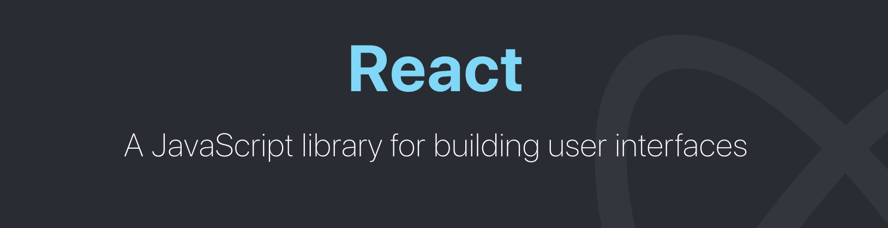
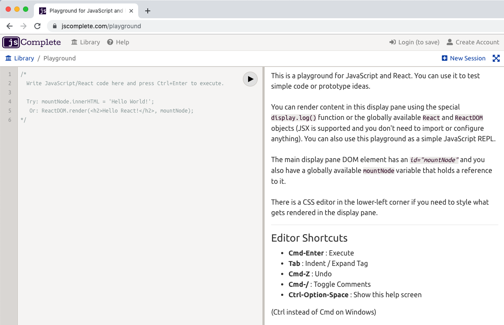

= Introduction
ifdef::env-github[]
:tip-caption: :bulb:
:note-caption: :bookmark:
:important-caption: :boom:
:caution-caption: :fire:
:warning-caption: :warning:
endif::[]

React is defined as a JavaScript library for building user interfaces. Let's start by talking about this definition.

== React, the big picture

**React is a JavaScript "library"**. It is not exactly a "framework". This usually means that React is not something you'd use on its own. You will often need to use more libraries with it in your applications and it does not assume anything about the other parts of your applications.

Frameworks serve a great purpose, especially for young teams and startups. When working with a framework, many smart design decisions are already made for you, which gives you a clear path to focus on writing good application-level logic. However, frameworks come with some disadvantages. For experienced developers working on large codebases, these disadvantages are sometimes a deal breaker.

Frameworks are usually not flexible. A framework requires you to code everything a certain way. If you try to deviate from that way, it usually ends up fighting you about it. Frameworks are also usually large and full of features. If you need to use only a small piece of them, you have to include the whole thing anyway. Admittedly, this point is changing today but it is still not ideal. Some frameworks are going modular, which I think is great, but I am a big fan of the pure Unix philosophy:

[quote, Doug McIlroy]
Write programs that do one thing and do it well. Write programs to work together.

React follows the Unix philosophy because it is a small library that focuses on just one thing and on doing that thing extremely well. That "one thing" is the second part of the React's definition: **Building User Interfaces**.

A User Interface (UI) is anything we put in front of users to have them interact with a machine. UIs are everywhere, from the simple buttons on a microwave to the dashboard of a space shuttle. If the device we are trying to interface can understand JavaScript, we can use React to describe a UI for it. Since Web browsers understand JavaScript, we can use React to describe Web UIs.

[TIP]
--
This book is exclusively about using React to build web user interfaces. See https://jscomplete.com/react-native[jscomplete.com/reac-native^] if you're interested to learn how to use React for building iOS and Android user interfaces.
--

I like to use the word **describe** here because that is what **we** (the coders) basically do with React. We just tell it what we want and React will then build the actual UI, on our behalf, in the Web browser. Without React or similar libraries, we would need to manually build UIs with native Web APIs and JavaScript and that is not as easy.

When you hear the statement that "React is declarative" this is exactly what it means. We describe UIs with React and tell it what we want (not how to do it). React will take care of the "how" and translate our declarative descriptions (which we write in the React language) to actual UIs in the browser. React shares this simple declarative power with HTML itself, but with React we get to be declarative for HTML UIs that represent dynamic data, not just static data.

When React was released, there was a lot of buzz about its performance because it introduced the smart idea of a virtual DOM that can be used to reconcile the actual DOM (and we'll talk about that in the next section). While React's performance is still one of the most important reasons why it is extremely popular today, I don't classify it as the "best" thing about it. I think React was a game changer because it created a common language between developers and browsers. That language allows developers to declaratively describe UIs and manage actions on their state instead of actions on their DOM elements. It's simply the language of user interface "outcomes". Instead of coming up with steps to describe actions on user interfaces, developers just describe the interfaces in terms of a "final" state (like a function). When actions happen to that state, React takes care of updating the UIs in the DOM based that description (and it does that efficiently as we'll see next).

If someone asked you to give **one reason** why React is worth learning, this outcomes-based UI language is it. I call this language "the React language". We'll start expoling that language in Chapter 3.

[TIP]
--
DOM is "Document Object Model". It's the browsers' programming interface for HTML (and XML) documents that treats them as tree structures. The DOM API can be used to change a document structure, style, and content.
--

== Learning React

First and foremost, you need to make peace with the fact that you need to learn more than just React to work with React. This is a good thing. React is a small library and it is not the answer to everything. However, you need to identify whether what you are learning is React or not, mainly so that you do not get confused about your efforts to learn React itself.

[quote]
The React API is very small. I think a programmer who is comfortable with HTML and JavaScript would be able to pick up 100% of the React API in a matter of few days (this is not counting the tools and libraries in the React ecosystem like Redux or React Router).

There is an important question about the order with which you need to learn things. This order would vary based on what skills you have. It goes without saying that you need a good understanding of JavaScript and HTML before taking your first steps with React.

Let me try to be specific about the HTML/JavaScript knowledge that you need before learning React. If you do not know what the DOM is, if you do not understand the concept of children and parent nodes, if you do not know how to map or reduce an array, or if you do not understand the concept of closures and promises, you are probably not ready for React. No worries though. This book got you covered. Chapter 2 is a refresher on all the JavaScript you need before learning React (including ES2015-ES2020 modern JavaScript syntax).

Also in Chapter 2 you will learn the basics of Node.js because it is the most popular platform for tools to make working with React easier. This is the chapter I design for you to skip if you're already comfortable with JavaScript and a bit of Nodejs.

[TIP]
--
While you can use React without learning the modern JavaScript capabilities, these capabilities make JavaScript a much better language. Also, most of the examples, courses, and tutorials you will find out there use the modern JavaScript features.
--

With a solid JavaScript understanding, you'll be ready to learn the top methods of the React API (e.g. `React.createElement`, `React.Component`, ...). You'll learn these in Chapters 3 and 4 and then you'll put that knowledge in action in Chapters 5-8.

Once you are comfortable with the top API methods, you'll be ready to veture into the more advanced ones (e.g. `React.useContext`, `React.memo`, ...). We'll do that in Chapters 9-11

In Chapter 12, you'll learn how to reuse your front-end React code on the server to create what is known as **Isomorphic/Universal applications**. This concept is also commonly referred to as SSR (server-side rendering).

In the final chatper, I'll tell you a little bit about deploying React applications to production servers.

The best thing you can possibly do to learn any coding library is to build things with it using your own ideas and typing your own code. Do not copy/paste examples and do not follow instructions blindly. Mirror the instructions to build something else (ideally, something you care about).

While understanding the apps we will build in this book, try to come up with different ideas and implement them as well. Try to improve the apps and add more features beyond what is presented in this book. I'll provide some bonus challenges for you at the end of chapters. Try to implement all of these challenges and do not be afraid to make mistakes. Building things with your own hands is the only truly helpful strategy when it comes to learning programming in general. React is no different.

[quote, Richard Branson]
You don't learn to walk by following rules. You learn by doing, and by falling over.

== The jsComplete playground

To follow along with all the examples that we will do from now on, you can first use the **jsComplete Playground** (https://jscomplete.com/playground[jscomplete.com/playground^]). It is a tool where you can test your JavaScript and React code right in the browser without any need to install or configure anything.

The tool has a simple interface. The left side is the editor where you write your JavaScript and React code. The latest version of both React and ReactDOM are already pre-loaded there. The editor also understands the JSX extension and all the modern features in JavaScript. This will allow you to focus on the React API itself rather than configuring and compiling a React application.

The right side is the preview panel where a pre-defined `mountNode` DOM element can be used to show content (and errors if any).

For example, try these lines:

.Putting "Hello!!" in the preview area
[source, jsx]
----
mountNode.innerHTML = 'Hello!!';
----

.Errors show up too
[source, jsx]
----
mountNode.innerHTML = Hello!!;
----

.You can use it as a simple REPL
[source, jsx]
----
3 == '3'
----

.React, ReactDOM, and JSX are all built-in
[source, jsx]
----
ReactDOM.render(
Hello React
, mountNode);
----

Starting in Chapter 5, we'll use a local development environment and improve it as we make progress in the more advanced concepts in React.

[IMPORTANT]
--
**This book is part of the jsComplete library which is FREE. We ask you to please donate what you can to https://jscomplete.com/fri[a cause that is fighting racial injustice^]**.

Writing high quality content takes a lot of time. If you found this helpful please consider https://github.com/sponsors/samerbuna[supporting the author^] 🙏.
--
