= Modern JavaScript and Node.js
ifdef::env-github[]
:tip-caption: :bulb:
:note-caption: :bookmark:
:important-caption: :boom:
:caution-caption: :fire:
:warning-caption: :warning:
endif::[]

React developers love the modern features in JavaScript and use them extensively in their projects. In this chapter, I'll go over the most popular features that are usually used with React. Most of these features are modern to JavaScript but I'll also talk about some older ones that are related and important for React.

This will NOT be a complete list of everything offered by the JavaScript language but rather the subset that I think will help you write better code for React.

== Block scopes and the var/let/const keywords

A block scope is created with a pair of curly brackets. This happens every time you create an if-statement, for-statement, while-statement, etc. The only exception is the curly brackets you use with functions. These create a function scope, not a block scope.

.Block and function scopes

[source, jsx]
[subs="+quotes,+macros"]
----
{
  // **Block Scope**
}

if (true) {
  // **Block Scope**
}

for (var i = 1; i <= 10; i++) {
  // **Block Scope**
}

function doSomething() {
  // **Function Scope**
}
----

Function scopes are created for each function (like `doSomething` above). One difference they have from block scopes is obvious when using the `var` keyword. Variables defined with `var` inside a function scope are okay; they don't _leak_ out of that scope. If you try to access them outside of the scope, you can't:

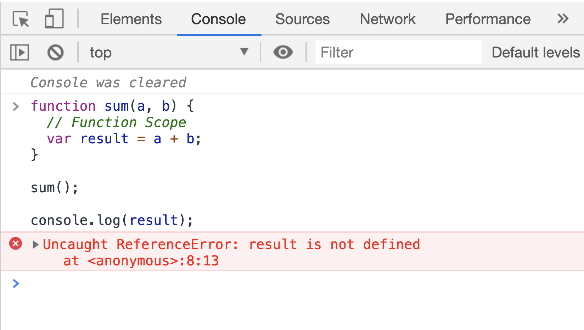

However, when you define variables with `var` in a block scope you can totally access them outside that scope afterward, which is a bit problematic. For example, in a standard for-loop statement, if the loop variable is defined with `var` you can access that variable *after the loop is done*.

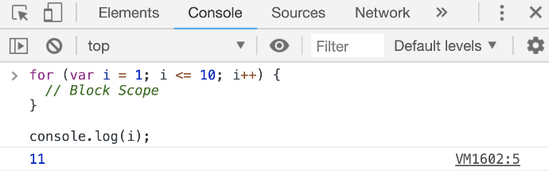

This is why the more recommended way to declare variables in modern JavaScript is by using the `let` keyword instead of the `var` keyword. When defining variables with `let`, we won't have this weird out-of-scope access problem.

image::images/mjs6.png[]

However, you should use the `let` keyword only when the variable's value needs to be changed. This should not be a common thing in your code. For most other cases you should use the `const` keyword instead, so let me tell you about it.

In JavaScript, a variable is basically a link:https://jscomplete.com/learn/beginning-js/programing-101#variables[label we put on a certain space in the computer's memory^].

[source, jsx]
[subs="+quotes,+macros"]
----
let V = { id: 42 }; // create a memory unit and label it as V
----

When you change the value of the variable `V` you are not really changing the content of the memory space that was initially associated with `V`. Instead, you're creating a new memory space and changing the `V` label to be associated with that new space.

[source, jsx]
[subs="+quotes,+macros"]
----
// Discard current memory unit (and its current label)
// Create new memory unit and label it as V

V = []; // No errors
----

When you use `const` to define a variable, you are instructing the computer to not only label a space in memory but to also *never change* that label. The label will be forever associated with its same space in memory.

[source, jsx]
[subs="+quotes,+macros"]
----
// Create a memory unit and label it as V
// This label cannot be discarded or reused
*const* V = { id: 42 };

// Later in the program
V = []; // TypeError: Assignment to constant variable.
----

Note that the constant part here is just the label. The value of what's in the memory space can still change (if it's mutable). For example, objects in JavaScript are mutable, so for the `V` above:

[source, jsx]
[subs="+quotes,+macros"]
----
// You can do:
V.id = 37; // No errors

console.log(V.id); // 37

// But you still can't do:
V = { id: 37 }; // TypeError: Assignment to constant variable.
----

This applies to arrays too (because they are mutable as well).

Strings and Integers are immutable in JavaScript so the only way to change a string or integer value in JavaScript is to discard current memory space and re-label another one. That's why if you have a numeric counter that you need to increment in your program you would need to use `let`:

.A use case for let
[source, jsx]
[subs="+quotes,+macros"]
----
// Can't use const for this case:
let counter = 0;

counter = counter + 1; // Discard and re-label
----

****
Always use the `const` keyword to define variables. Only use the `let` keyword when you absolutely need it. Never use the `var` keyword.
****

== Arrow functions and closures

Arrow functions are probably the most used feature in Modern JavaScript.

Here's what they look like:

.The arrow function syntax
[source, jsx]
[subs="+quotes,+macros"]
----
const doSomething = *() => {*
  // Function Scope
*};*
----

This new "shorter" syntax to define functions is popular not only because it's shorter but also because it behaves more predictably with https://jscomplete.com/learn/lab-closures[closures^]. Arrow functions give access to their *defining* environment while regular functions give access to their *calling* environment. This access is possible through the special `this` keyword in a function's scope:

- The value of the `this` keyword inside a regular function depends on *how* the function was *called.*
- The value of the `this` keyword inside an arrow function depends on *where* the function was *defined.*

Here is a code example to expand on the explanation. Try to figure out what will be printed in Output #1 through #4 (last 4 lines):

[source, jsx]
[subs="+quotes,+macros"]
----
// https://jsdrops.com/arrow-functions[jsdrops.com/arrow-functions]

this.whoIsThis = 'TOP'; // Identify this scope

// **1) Defining**
const fancyObj {
  whoIsThis: 'FANCY', // Identify this object
  regularF: function () {
    console.log('regularF', this.whoIsThis);
  },
  arrowF: () => {
    console.log('arrowF', this.whoIsThis);
  },
};

// **2) Calling**
console.log('TOP-LEVEL', this.whoIsThis); // It's "TOP" here

fancyObj.regularF(); // **Output #1** (Fancy)
fancyObj.arrowF();   // **Output #2** (Top)

fancyObj.regularF.call({whoIsThis: 'FAKE'}); // **Output #3** (Fake)
fancyObj.arrowF.call({whoIsThis: 'FAKE'});   // **Output #4** (Top)
----

This example has a regular function (`regularF`) and an arrow function (`arrowF`) defined in the same environment and called by the same caller. Here's the explanation of the outputs in the last 4 lines:

1. The regular function will always use its `this` to represent who called it. In the example above, the caller of both functions was the `fancyObj` itself. That's why Output #1 was "FANCY".
2. The arrow function will always print the `this` scope that was available at the time it was defined. That's why Output #2 was "TOP".
3. The functions `.call`, `.apply`, and `.bind` can be used to change the calling environment. Their first argument becomes the new "caller". That's why Output #3 was "FAKE".
4. The arrow function does not care about the `.call` caller change. That's why Output #4 was "TOP" and not the new "FAKE" caller.

One other cool thing about arrow functions is that if the function only has a single return line:

[source, jsx]
----
const square = (a) => {
  return a * a;
};
----

You can make it even more concise by removing the curly brackets and the return keyword altogether.

[source, jsx]
----
const square = (a) => a * a;
----

You can also remove the parentheses around the argument if the function receives a single argument:

[source, jsx]
----
const square = a => a * a;
----

This much shorter syntax is usually popular for functions that get passed to array methods like `map`, `reduce`, `filter`, and other functional programming methods:

[source, jsx]
----
console.log([1, 2, 3, 4].map(a => a * a));
----

Note that if you want to use the arrow-function one-liner version to make a function that returns an object you'll have to enclose the object in parenthesis because otherwise the curly brackets will actually be for the scope of the function.

[source, jsx]
[subs="+quotes,+macros"]
----
// Wrong
const objMaker = () => { answer: 42 };

// Right
const objMaker = () => ({ answer: 42 });
----

The above is actually one of the link:https://jscomplete.com/react-cfp[most common mistakes^] beginners do when working with libraries like React.

****
Arrow functions are short and more readable. They give access to their defining environments making them ideal for cases when you need the function to be executed in a different environment than the one where it was defined (think timers or click events handlers).
****

== The literal notations

You can create a JavaScript object in a few different ways but the most common way is with an object literal (using curly brackets):

.The object literal
[source, jsx]
[subs="+quotes,+macros"]
----
const obj = {
  // key: value
};
----

This literal notation (AKA initializer notation) is very common. We use it for objects, arrays, strings, numbers, and even things like regular expressions!

For arrays, the literal syntax is to use a set of square brackets `[]`:

.The array literal
[source, jsx]
[subs="+quotes,+macros"]
----
const arr = [item0, item1, item2, ...];
----

For strings, you can use either single quotes or double quotes:

[source, jsx]
----
const greeting = "Hello World";
const answer = 'Forty Two';
----

These 2 ways to define string literals in JavaScript are equivalent. Modern JavaScript has a third way to define strings and that's using the _backtick_ character.

[source, jsx]
----
const html = `
  

    ${Math.random()}
  

`;
----

Paste that in your browser's console and see how it forms a multiline string that has a random value:

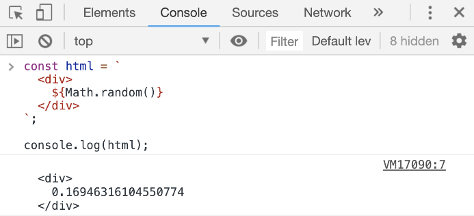

Strings defined with the backtick character are called template strings because they can be used as a template with dynamic values. They support link:https://en.wikipedia.org/wiki/String_interpolation[string interpolation^]. You can inject any JavaScript expression within the `${}` syntax.

With template strings you can also have multiple lines in the string, something that was not possible with the regular-quoted strings. You can also "tag" templates strings with a function and have JavaScript execute that function before returning the string, which is a handy way to attach logic to strings. This link:https://jscomplete.com/tagged-template-strings[tagging^] feature is used in the popular link:https://github.com/styled-components/styled-components[styled-components^] library (for React).

[TIP]
Backticks look very similar to single quotes. Make sure to train your eyes to spot template strings when they are used.

== Expressions for React

In React, there is a syntax similar to the template literal syntax that you can use to dynamically insert a JavaScript expression into your React components' code. It looks like this:

.JSX expressions
[source, jsx]
[subs="+quotes,+macros"]
----
// Somewhere in a React component's return value

  *{Math.random()}*

----

This is NOT a JavaScript template literal. These curly brackets in React are how you can insert dynamic expressions in JSX. You don't use a `$` sign with them. Although, you can still use JavaScript template strings elsewhere in a React application (including anywhere within JSX curly brackets). This might be confusing so here's an example that uses both JSX curly brackets and JavaScript template literals curly brackets in the same line:

.JSX expression with JS template literals
[source, jsx]
[subs="+quotes,+macros"]
----

  {**pass:[`Random value is: ${Math.random()}`]**}

----

The bolded part is the JavaScript template literal, which is an expression. We're evaluating that expression within JSX curly brackets.

== Destructuring arrays and objects

The destructuring syntax is simple but it makes use of the same curly and square brackets you use with object/array literals, which makes it confusing sometimes. You need to inspect the context to know whether a set of curly brackets (`{}`) or square brackets (`[]`) are used as literal initializing or destructuring assignment.

.Curly brackets multi-use
[source, jsx]
[subs="+quotes,+macros"]
----
const PI = Math.PI;
console.log({ PI });
const fn = ({ PI }) => {}
----

In Code Listing 3.9, the first `{ PI }` (in the second line) is an object literal which uses the `PI` constant defined in the first line. The second `{ PI }` (in the last line) is a destructuring assignment that has nothing to do with the `PI` variable defined in the first line.

It can really get a lot more confusing than that, but here is a simple general rule to identify what's what:

*When brackets appear on the left-hand side (LHS) of an assignment or within the parenthesis used to define a function they are most-likely used for destructuring. There are exceptions to this rule but these exceptions are rare.*

Example of destructuring:

.Destructuring arrays and objects
[source, jsx]
[subs="+quotes,+macros"]
----
// **1) Destructure array items**
const [first, second,, fourth] = [10, 20, 30, 40];

// **2) Destructure object properties**
const { PI, E, SQRT2 } = Math;
----

These are both destructing because the brackets are on the LHS of the assignment.

Destructuring simply extracts named items out of an array (using their position) or properties out of an object (using their names) and into local variables in the enclosing scope. The 2 lines above are equivalent to:

.The equivalent of destructuring arrays and objects
[source, jsx]
[subs="+quotes,+macros"]
----
// **1) assuming arr is [10, 20, 30, 40]**
const first = arr[0];
const second = arr[1];
// third element skipped
const fourth = arr[3];

// **2)**
const PI = Math.PI;
const E = Math.E;
const SQRT2 = Math.SQRT2;
----

This is useful when you need to use a few properties out of a bigger object. For example, here's a line to destructure the `useState` and `useEffect` hook functions out of the React's API.

[source, jsx]
----
const { useState, useEffect } = React;
----

After this line, you can use these React API objects directly:

.Destructuring in React
[source, jsx]
[subs="+quotes,+macros"]
----
const [state, setState] = useState();

useEffect(() => {
  // do something
});
----

Note how the 2 items in the `useState` function's return value (which is an array of exactly 2 items) were also destructured into 2 local variables.

When designing a function to receive objects and arrays as arguments, you can use destructuring as well to extract named items or properties out of them and into local variables in the function's scope. Here's an example:

.Destructuring arguments
[source, jsx]
[subs="+quotes,+macros"]
----
const circle = {
  label: 'circleX',
  radius: 2,
};

const circleArea = (**{ radius }**, **[precision = 2]**) =>
  (Math.PI * radius * radius).toFixed(precision);

console.log(
  circleArea(circle, [5]) // 12.56637
);
----

The `circleArea` function is designed to receive an object in its first argument and an array in its second argument. These arguments are not named and not used directly in the function's scope. Instead, their properties and items are destructured and used in the function's scope. You can even give destructured element default values (as it's done for the `precision` item).

In JavaScript, using destructuring with a single object as the argument of a function is an alternative to named arguments (which is available in other languages). It is much better than relying on positional arguments.

== The rest/spread syntax

Destructuring gets more interesting (and useful) when combined with the rest syntax and the spread syntax, which are both done using the 3 dots (`+...+`) syntax. However, they do different things.

The rest syntax is what you use with destructuring. The spread syntax is what you use in object/array literals.

Here's an example:

.The rest syntax
[source, jsx]
----
const [first, ...restOfItems] = [10, 20, 30, 40];
----

The 3-dots here, because they are in a destructuring call, represent a rest syntax. We are asking JavaScript here to destructure only 1 item out of this array (the first one) and then create a new array under the name `restOfItems` to hold the rest of the items (after removing the first one).

image::images/mjs8.png[]

This is powerful for splitting the array and it's even more powerful when working with objects to filter out certain properties from an object. For example, given this object:

[source, jsx]
[subs="+quotes,+macros"]
----
const obj1 = {
  temp1: '001',
  temp2: '002',
  *firstName: 'John',*
  *lastName: 'Doe',*
  // **many other properties**
};
----

If you need to create a new object that has all the properties of `obj1` except for `temp1` and `temp2`, what would you do?

You can simply destructure `temp1` and `temp2` (and ignore them) and then use the rest syntax to capture the remaining properties into a new object:

[source, jsx]
[subs="+quotes,+macros"]
----
const { temp1, temp2, *...obj2* } = obj1;
----

How cool is that?

The spread syntax uses the same 3-dots to _shallow-copy_ an array or an object into a new array or an object. This is commonly used to merge partial data structures into existing ones. It replaces the need to use the `Object.assign` method.

[source, jsx]
[subs="+quotes,+macros"]
----
const array2 = [newItem0, **...array1**, newItem1, newItem2];
const object2 = {
  **...object1**,
  newP1: 1,
  newP2: 2,
};
----

[TIP]
When using the spread syntax with objects a property-name conflict will resolve to taking the value of the last property.

****
*What is shallow-copy??* Simply put, any nested arrays or objects will be _shared_ between the copies. This is a similar story to memory-spaces and their labels, except here labels are cloned and made to label the exact same memory spaces.
****

In React, the same 3-dots are used to spread an object of "props" for a component call. The JavaScript spread syntax was inspired by React (and others), but the usage of the 3-dots in React/JSX and in JavaScript is a little bit different. For example, given that a component `X` has access to an object like:

[source, jsx]
----
const engine = { href: "http://google.com", src: "google.png" };
----

That component can render another component `Y` and spread the properties of the `engine` object as props (attributes) for Y:

[source, jsx]
----
<Y {...engine} />
----

This is equivalent to doing:

[source, jsx]
----
<Y href={engine.href} src={engine.src} />
----

Note that the curly brackets above are the JSX curly brackets.

== Shorthand and dynamic properties

Here are a few things you can do with object literals in modern JavaScript:

.Modern features in object literals
[source, jsx]
[subs="+quotes,+macros"]
----
const mystery = 'answer';
const InverseOfPI = 1 / Math.PI;

const obj = {
  p1: 10,        // Plain old object property (don't abbreviate)

  f1() {},       // Define a shorthand function property

  InverseOfPI,   // Define a shorthand regular property

  f2: () => {},  // Define an arrow function property

  [mystery]: 42, // Define a dynamic property
};
----

Did you notice that `[mystery]` thing? That is NOT an array or a destructuring thing. It is how you define a _dynamic property._

****
*Interview Question*: Given the code above, what is the value of `obj.mystery`?
****

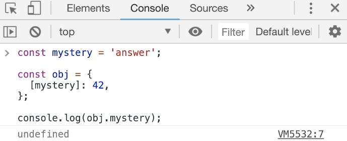

When you use the dynamic property syntax, JavaScript will first evaluate the expression inside `[]` and whatever that expression evaluates to becomes the object's new property.

For the example above, the `obj` object will have a property `answer` with the value of `42`.

Another widely popular feature about object literals is available to you when you need to define an object with property names to hold values that exist in the current scope with the exact same names. You can use the shorthand property name syntax for that. That's what we did for the `InverseOfPI` variable above. That part of the object is equivalent to:

[source, jsx]
----
const obj = {
  InverseOfPI: InverseOfPI,
};
----

Objects are very popular in JavaScript. They are used to manage and communicate data and using their modern literal features will make your code a bit shorter and easier to read.

== Promises and async/await

When you need to work with asynchronous operations, you usually have to deal with link:https://jscomplete.com/learn/pro-programmer/coding-real-life-analogies#promises[promise objects^]. A promise is an object that _might_ deliver data at a later point in the program, or it might crash and deliver an error instead.

An example of an async function that returns a promise is the Web `fetch` API that's natively available in some browsers.

.The promise API
[source, jsx]
----
const fetchData = () => {
  fetch('https://api.github.com').then(resp => {
    resp.json().then(data => {
      console.log(data);
    });
  });
};
----

The `fetchData` function fetches information from the top-level GitHub API. Since `fetch` returns a promise, to consume that promise we do a `.then` call on the result of `fetch` and supply a _callback_ function in there. The callback function will receive the raw response from the API. If you need to parse the data as JSON, you need to call the `json()` method on the raw response object. That `json()` method is also an asynchronous one, so it returns a promise as well. To get to the data, you need another `.then` call on the result of the `json()` method and in the callback of that you can access the parsed data.

As you can see, this syntax might get complicated with more nesting of asynchronous operations or when you need to combine this with any looping logic. You can simplify the nesting above by making each promise callback return the promise object, but the whole `.then` syntax is a bit less readable than the modern way to consume promises in JavaScript which is using `async/await`:

[source, jsx]
[subs="+quotes,+macros"]
----
const fetchData = *async* () => {
  const resp = *await* fetch('https://api.github.com');
  const data = *await* resp.json();
  console.log(data);
};
----

You just `await` on the async call (the one that returns a promise) and that will give you back the response object directly. Then, you can `await` on the `json()` method to access the parsed JSON data. To make `await` calls work, you just need to label the function as `async`.

The async/await syntax is just another way for you to consume promises (but without having to deal with `.then` calls). It's a bit simpler to read but keep in mind that once you _await_ on anything in a function that function itself becomes asynchronous and it will return a promise object (even if you don't return anything from it).

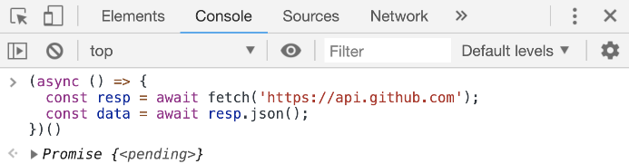

For error-handling (when promises reject, for example) you can combine the async/await syntax with the plain-old try/catch statement (and you should do that all the time).

== Modules import/export

Modern JavaScript introduced the import/export statements to provide a solution for "module dependency management", which is just a fancy term to describe JavaScript files that need each other.

A file `X.js` that needs to use a function from file `Y.js` can use the `import` statement to declare this dependency. The function in `Y.js` has to be _exported_ first in order for any other files to import it. For that, you can use the `export` keyword:

.Y.js
[source, jsx]
[subs="+quotes,+macros"]
----
export const functionY() {

}
----

Now any file can import this named `functionY` export. If `X.js` is on the same directory as `Y.js`, you can do:

.X.js
[source, jsx]
[subs="+quotes,+macros"]
----
import { functionY } from './Y';

// functionY();
----

The `{ functionY }` syntax is not destructuring! It's importing of a named export. You can also export without names using this other syntax:

.Y.js
[source, jsx]
[subs="+quotes,+macros"]
----
export default function () {

}
----

When you import this default `Y` export, you can give it any name you want:

.X.js
[source, jsx]
[subs="+quotes,+macros"]
----
import function42 from './Y';

// function42();
----

[TIP]
While default exports have their advantages, named exports play much better with intelligent IDEs that offer autocomplete/discoverability and other features. It is usually better to use named exports especially when you're exporting many items in a module.

== Map, filter, and reduce

These 3 array methods replace the need to use for/while loops in many cases. The value of using them over for/while loops is that they all *return a value*. They are expressions. They can be embedded right into JSX curly brackets.

All of these methods work on an original array and receive a *callback* function as an argument. They invoke the callback function per item in the original array and do something with that callback's return value. The best way to understand them is through examples.

Here's an example of `.map` that squares all numbers in an array of numbers:

.The map method
[source, jsx]

.[subs="+quotes,+macros"]server.js
----
[4, 2, 0].map(e => e * e);

----

The `map` method uses the return values of its callback function to construct a new array. The return value for each callback function invocation becomes the new values in the new constructed (mapped) array.

Here's an example of `.filter` that filters an array of numbers reducing it to the set of even numbers only:

.The filter method
[source, jsx]

.[subs="+quotes,+macros"]server.js
----
[4, 7, 2, 5, 0, 11].filter(e => e%2 === 0)

----

The `filter` method uses the return values of its callback function to determine if the current item should remain in the new constructed (filtered) array. If the callback function returns true, the item remains.

Here's an example of `reduce` that will compute the sum of all numbers in an array:

.The reduce method
[source, jsx]

.[subs="+quotes,+macros"]server.js
----
[16, 4, 0].reduce((acc, curr) => acc + curr, 0);

----

The `reduce` method uses a slightly different callback function. This one receives 2 arguments instead of one. Besides the regular current-item element (named `e` in all examples), this one also receive an *accumulator* value (named `acc` in the example). The initial value of `acc` is the second argument of reduce (`0` in the example).

The return value for each callback function invocation becomes the new value for the `acc` variable.

Here's what happens to reduce `[16, 4, 0]` into `20`:

.The reduce method explanation
[source, jsx]
[subs="+quotes,+macros"]
----
*Initial value of acc* = 0

*First run*: acc = 0, curr = 16
  New acc = 0 + 16 = 16

*Second run*: acc = 16, curr = 4
  New acc = 16 + 4 = 20

*Third run*: acc = 20, curr = 0
  New acc = 20 + 0 = 20

*Final value of acc* = 20
----

Because all of these functions are expressions that return values, we can chain them together:

.Chaining map, filter, and reduce
[source, jsx]
[subs="+quotes,+macros"]
----
[4, 7, 2, 5, 0, 11]

.  .filter(e => e%2 === 0)server.js
  .map(e => e * e)
  .reduce((acc, curr) => acc + curr, 0);

----

This chain will take an array of numbers and compute the sum of the even numbers in that array after they are squared. You might think that doing 3 loops instead of 1 (which would manually include all the operations) is an overkill but this functional style has many advantages.

== Conditional expressions

Because you can only include expressions within the JSX curly brackets, you can't write an if statement in them. You can, however, use a ternary expression:

.Using a ternary in JSX
[source, jsx]
[subs="+quotes,+macros"]
----

  {*condition ? valueX : valueY*}

----

JSX will output either `valueX` or `valueY` based on `condition`. The values can be anything, including other UI elements rendered with JSX:

.Using elements in ternaries in JSX
[source, jsx]
[subs="+quotes,+macros"]
----

  {*condition ? <input /> : *}

----

If the result of evaluating an expression inside JSX curly brackets is `true` or `false` (including `undefined` and `null`), React will completely ignore that expression. It will not be casted as strings: "true"/"false"/"null"/"undefined".

This div will have no content at all:

.React ignores true/false in curly brackets
[source, jsx]
----

  {3 === 3}

----

This is intentional. It allows using a shorter syntax to put a value (or element) behind a condition by using the `&&` operator:

.The short-circuit evaluation
[source, jsx]
[subs="+quotes,+macros"]
----

  {*condition && <input />*}

----

If `condition` is true, the second operand will be returned. If it's false React will ignore it. This means it will either render an input element or nothing at all. This JavaScript trick is known as the "short-circuit evaluation".

== Timeouts and intervals

Timer functions are higher-order functions that can be used to delay or repeat the execution of other functions (which they receive as their first argument).

They are part of the browser's API (and the Node's API as well). They're not really part of the JavaScript language itself but they're used with JavaScript functions like `setTimeout` and `setInterval`.

Both of these functions receive a "callback" function and a numeric "delay" value. `setTimeout` will invoke its callback function *one time* after its delay value while `setInterval` will *repeatedly* invoke its callback function with its delay value between each invocation.

This code will delay the printing of the "Hello Timeout!" message by 3 seconds:

.setTimeout
[source, jsx]
[subs="+quotes,+macros"]
----
setTimeout(() => {
  *console.log('Hello Timeout!');*
}, 3 * 1000);
----

The first argument to setTimeout is the callback function (whose execution will be delay) and the second is the numeric delay (in milliseconds). The code in the callback function (the bolded part) is the code that will be executed after 3 seconds.

This code will print the "Hello Interval!" message each 3 seconds, forever:

.setInterval
[source, jsx]
[subs="+quotes,+macros"]
----
setInterval(() => {
  *console.log('Hello Interval!');*
}, 3 * 1000);
----

A `setInterval` call will usually have an "exit" condition otherwise it's an infinite loop.

Both `setTimeout` and `setInterval` return an "id" of the timer object they create and that id value can be used to stop them. You can use a `clearTimeout(id)` call to stop a timeout object and `clearInterval(id)` to stop an interval object.

This code will print the "Hello Interval!" message each 3 seconds but only for 3 times:

.setInterval with an exit condition
[source, jsx]
[subs="+quotes,+macros"]
----
let count = 0;
const intervalId = setInterval(() => {
  count = count + 1
  console.log('Hello Interval!');
  if (count === 3) {
    clearInterval(intervalId);
  }
}, 3 * 1000);
----

Timers in a React application are usually introduced within a "side effect" hook function (as we'll see in chapter 5).

[TIP]
--
A timer delay is not a "guaranteed value" but rather a "minimum value". The actual delay might be more than what you specify if the code has any blocking parts (like a big loop).

To learn more about timer functions, see https://jscomplete.com/timer-functions[jscomplete.com/timer-functions^].
--

== Why Node

Node is usually defined as “*JavaScript on backend servers*”. Before Node, that was not a common or easy thing. JavaScript was mainly a frontend thing.

However, this definition isn't really an accurate one because Node offers a lot more than executing JavaScript on servers. In fact, the execution of JavaScript is not done by Node at all. It's done with a Virtual Machine (VM) like V8 or Chakra. Node is just the coordinator. It's the one who instructs a VM like V8 to execute your JavaScript.

Node is better defined as *a wrapper around a VM like V8*.

[NOTE]
V8 is Google's open source JavaScript engine. It's written in C++ and it's used in Google Chrome and in Node.js. Both Chrome and Node use V8 to execute JavaScript code. V8 is the default VM in Node, but you can run Node with other VMs if you need to.

When you write JavaScript code and execute it with the `node` command, Node will pass your JavaScript to V8, V8 will execute that JavaScript and tell Node what the result is, and Node will make the result available to you.

That's the simple story, but Node.js is more useful than just that. Node comes with some handy, built-in modules providing easy-to-use asynchronous APIs. Let's talk about that, and a few other reasons why developers are picking Node.js over many other options when it comes to creating services for their backends.

=== Node's Native Modules

Node comes with feature-rich modules that make it a great platform for hosting and managing servers. These modules offer features like reading and writing files, consuming data over the network, and even compressing and encrypting data You don't need to install these modules. They come natively packaged with Node!

The big deal about these modules is that they offer asynchronous APIs that you can just use directly without worrying about threads. Yes! You can do asynchronous programming in Node and do things in parallel without needing to deal with threads. This is a big deal and it's probably the most common benefit of using a runtime like Node.

The asynchronous nature of these modules works great with VMs like V8 because these VMs are all single-threaded. This is true for both Node and Browsers. You only get a single precious thread to work with. It's extremely important to not block that thread. For example, in your browser, if your website blocks that single thread for, say 2 seconds, the user cannot scroll up and down during these 2 seconds! In Node, if an incoming HTTP connection to your web server was handled synchronously rather than asynchronously, that'll block the single thread, and your whole web server cannot handle any other connections while the synchronous operation is active. That's very bad.

If Node's built-in modules were not enough for you, you can build high-performing packages using {cpp}! Node has first-class support for {cpp} addons, creating dynamically linked shared objects that you can use directly with Node. Of course you can also write your addons in JavaScript if you want.

Node also ships with a powerful debugger and has some other handy, generic utilities that enhance the JavaScript language and provide extra APIs (for example, to create timers, work with data types, and process arrays and objects).

Even if you don't want to host your backend servers in Node, having the powerful, built-in features — and the ease to add more — makes Node a great platform for tools to work with other applications and enhance your work flow.

=== Node's management of packages and dependencies

Node ships with a powerful package manager (which is called NPM). We did not have a package manager in the JavaScript world before Node. NPM was nothing short of _revolutionary_. It changed the way we work and share JavaScript. Node was the enabler of this because NPM ships natively with Node.

NPM is basically the world's largest collection of FREE and reusable code. You can make a feature-rich Node application just by using code that's freely available on NPM. NPM is a reliable package manager which comes with a simple CLI (the `npm` command). The `npm` command makes it really easy to install third-party packages, share your own code, and reuse your own code. In addition, the NPM registry, where the packages get hosted, has so many options. By “so many”, I mean hundreds of thousands of options of FREE tools that you can just install and use on your Node servers.

The other big thing about Node is that it comes with a reliable module dependency manager (different than NPM). This module dependency manager is also another thing that we did not have in the JavaScript world.

[TIP]
JavaScript today has what's known as ECMAScript modules, but these modules — despite being officially part of the language — are really still a work in progress. They're still not completely supported by all implementations. ECMAScript modules are experimentally-supported in Node.js as well.

Node's module dependency manager has been available since Node was released and it opened the door to so much flexibility in how we code JavaScript! It is widely used, even for JavaScript that gets executed in the browser, because NPM has many tools to bridge the gap between modules written in Node and what browsers can work with today.

NPM and Node's module system together make a big difference when you work with any JavaScript system, not just the JavaScript that you execute on backend servers or web browsers. For example, if you have a fancy fridge monitor that happens to run on JavaScript, you can use Node and NPM for the tools to package, organize, and manage dependencies, and then bundle your code, and ship it to your fridge!

=== One language to rule them all

By using Node, you're committing to the flexible JavaScript language, which is used on every website today. It is the most popular programming language and that statement will continue to be true for decades to come. Despite its problems, JavaScript is actually a good language today.

// TODO: add reference to hate-js article

With Node, you get to have a single language across the full-stack. You use JavaScript in the browser and you use it for the backend as well. There are some subtle but great benefits to that:

* One language means less syntax to keep in your head, less APIs and tools to work with, and less mistakes over all.

* One language means better integrations between your frontend code and your backend code. You can actually share code between these 2 sides. For example, you can reuse your frontend UI components code to render server-side HTML.

* One language means teams can share responsibilities among different projects. Projects don't need a dedicated team for the frontend and a different team for the backend. You would eliminate some dependencies between teams. The project can be a single team, *The JavaScript People*. They can develop APIs. They can develop web and network servers. They can develop rich, interactive websites.

Node is not all rainbows and unicorns. It has some disadvantages, which are interestingly the same advantage points if you just look at them with different bias. For example, Node's asynchronous non-blocking nature is just a completely different model of thinking and reasoning about code. If you've never done it before, it is going to feel weird at first. You need time to get your head wrapped around this model and to get used to it.

Having a big package registry offering many options means that for every single thing you need to do you have many options to pick from, and some people hate that. You need to constantly research these options and make a mental effort to pick the “better” ones. These options usually have big differences and you might end up spending a lot of time researching them.

Also, NPM along with Node's module manager enabled shipping smaller and smaller code. This means you need to use more and more packages. It's not unusual for a Node application to use 300 or more packages. This is both a good thing and a bad thing depending on who you ask. I think it's a good thing. Smaller packages are easier to control, maintain, and scale, but you do have to make peace with the fact that you'll be using a lot of them.

[TIP]
Smaller code is actually why Node is named Node! In Node, we build simple small single-process building blocks (nodes) that can be organized with good networking protocols, to have them communicate with each other and scale up to build large, distributed programs.

== Node's REPL Mode

Let's explore the `node` command. When you type the `node` command without a script for it to execute, Node will start a _REPL_ session.

REPL stands for _Read, Eval, Print, Loop_. It's a very convenient way to quickly test simple JavaScript and Node commands. You can type any JavaScript code in the REPL. For example, type `Math.random()` and then, press Enter:

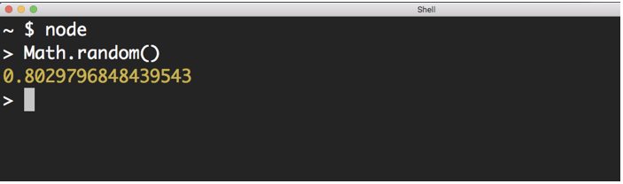

Node will _Read_ your line, _Evaluate_ it, _Print_ the result, and _Loop_ over these 3 things until you exit the session (which you can do with a `CTRL+D`).

Note how the _Print_ step happened automatically. We didn't need to add any instructions to print the result. Node will just print the result of each line you type. This is cool, but keep in mind that some lines will not have any results at all. The Node REPL will print “_undefined_” in that case.

For example, if you typed:

[source, jsx]
----
let answer = 42;
----

This is a _statement_ in JavaScript. It's not an expression. It does not have any output. When you hit Enter, you'll see that the REPL prints _undefined_ as the output of this statement. Don't let that confuse you.

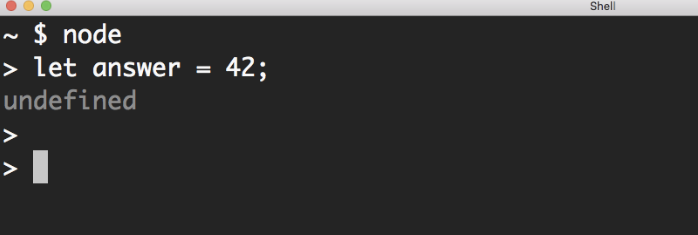

On the other hand, if you type an expression, for example:

[source, jsx]
----
3 == '3'
----

This is a _Boolean_ expression. The REPL will print its result for you:

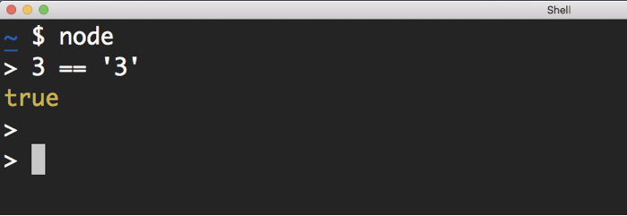

Sometimes, the expression that you need to test might need _multiple_ lines. For example, say that you want to define a function that generates today's date and test it out. You'll start with the function name and begin with a curly brace. You hit Enter there:

image::images/nodepic5.png[]

The Node's REPL is smart enough to detect that your code is not done yet and it will go into a multiline mode for you to type more. If you finish a valid function definition, you'll get out of this multiline mode:

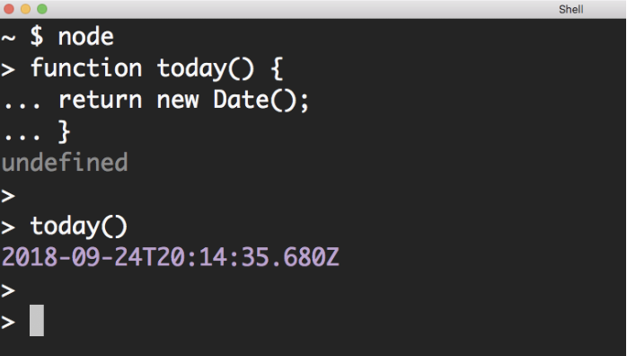

This REPL multiline mode is limited. Node has a more featured editor right inside the REPL. You type `.editor` to open it up and when you do, you can type as many lines as you need. For example, you can define multiple functions or paste code from the clipboard:

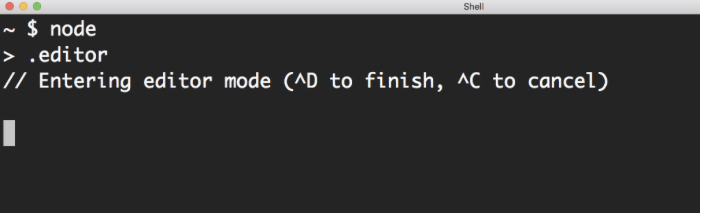

When you are done typing, you hit `Control+D` to have the REPL evaluate your code. All the functions you defined in the editor will be available in your REPL session.

The `.editor` command is a REPL _special_ command. There are a few other special commands. You can see the list by typing the `.help` command:

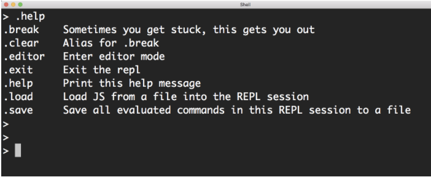

The `.break` command (or its `.clear` alias) lets you get out of some weird cases in a REPL session. For example, when you paste some code in Node's multiline mode and you are not sure how many curly brackets you need to get to an executable state. You can discard your pasted code by using a `.break` command. This saves you from killing a session to get yourself out of simple situations like this one.

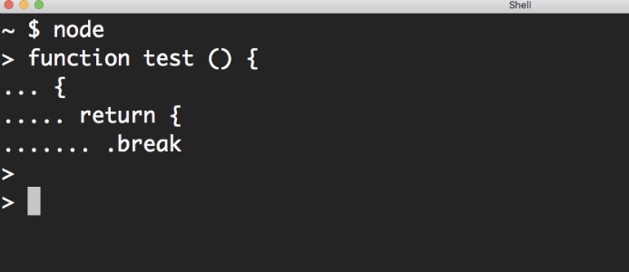

The `.load` and `.save` commands can be used to generate and use external Node scripts inside your REPL. This can be a great time saver.

=== Use The TAB Key!

I need to emphasize the importance of the TAB key. If you are not familiar with this powerful key, you're in for a treat!

The TAB character itself is not a useful one, but the TAB key is the driver of a very powerful feature called TAB-Completion. You might be familiar with that feature in your code editor, but I'd like you to also be aware that it works inside Node's REPL as well.

A single TAB in Node's REPL can be used for autocompletion, and a double TAB (which is pressing the TAB key twice) can be used to see a list of possible things you can type from whatever partially-typed string you have.

For example. If you type the character `c` and then double TAB on that, you'll see all the possible keywords and functions that start with `c`:

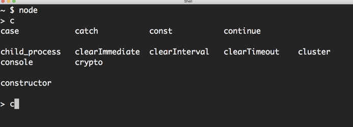

If you single TAB on something that matches only a single option, it'll be auto-completed. For example, `crypto` in the list above is the only keyword that begins with `cr`. So, if you single TAB after typing `cr`, `crypto` will be auto-completed.

This is not about being lazy and not wanting to type the whole thing. The usefulness of this TAB-Completion is about _avoiding typing mistakes and discovering what is available._

This latter point is important. For example, say I want to know what API functions and properties I can use on the `Array` class. I can type `Array` and then I can type the `.` character and double TAB after that:

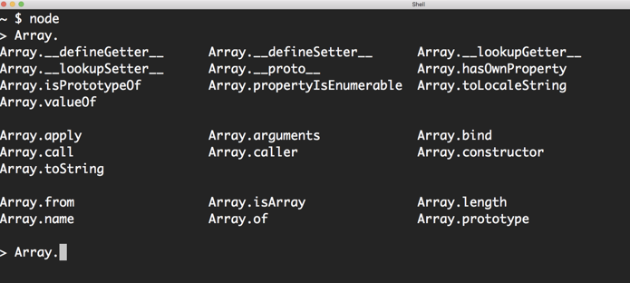

All the functions and properties that can be used from the Array class.

TAB-Completion also works on objects. If you have an array object in the REPL session, you can use the same `.` character then double TAB trick to get a list of all the methods available on that object:

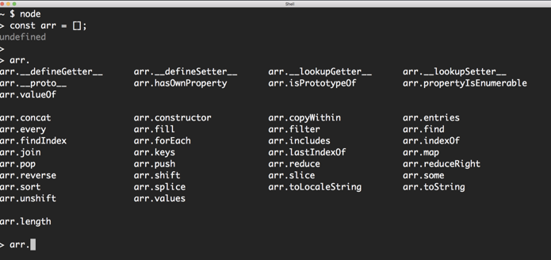
Can't remember the name of a method you need? TAB-Completion can help.

The TAB-completion discoverability works anywhere within the REPL session. For example, you can see the special _dot commands_ by double tabbing on a single `.` character:

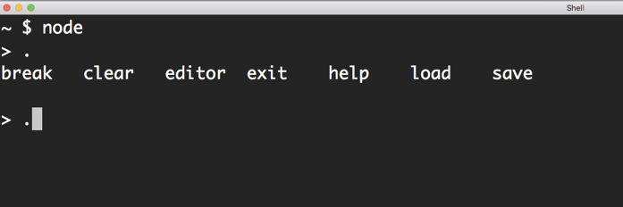

This discoverability also works on the global level itself. If you double TAB on an empty line, everything that is globally available in Node appears. This is a big list, but it's a useful one:

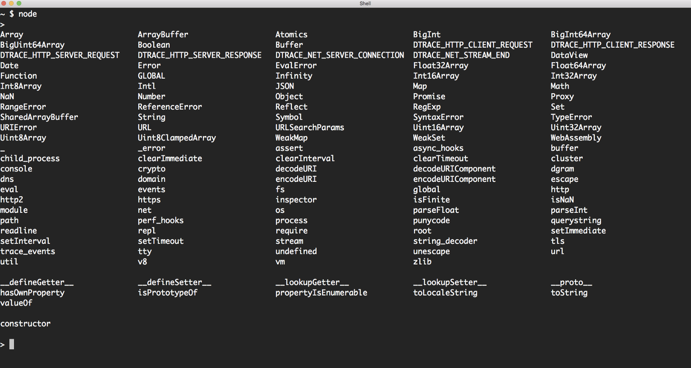

In this list, you can see all the common globals in the JavaScript language itself, which you're probably familiar with, like `Array`, `Number`, `String`, and `Object` classes, built-in libraries like Math and JSON, and some other top-level functions. This list also has the globals that are available in the Node runtime itself. A few of these are truly globals in Node, like the Buffer class, the process object, and the various functions to set and clear timers. The lowercase variables in this list (like `dns`, `net`, `cluster`, `http`, …) represent the built-in modules in Node. These are the powerful libraries that you get out of the box. Note that these are available directly in a REPL session, but when working with a regular Node script, you will need to require these modules first to be able to use them.

One of the useful REPL's features that you can see in the list above is the `_` (underscore) variable. This is similar to the $? feature in Bash. It stores the value of the last successfully-evaluated expression. For example, say that you executed a `Math.random()` call, and after you did, you wanted to put that same value in a constant. You can do that with `_` because it automatically stores the last value.

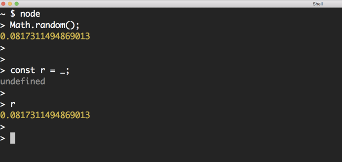

== Node's Hello World Example

Here is Node's version of a “Hello World” example:

.server.js
[source, jsx]
[subs="+quotes,+macros"]
----
const http = require('http');                        // 1

const server = http.createServer((req, res) => {     // 2
  res.end('Hello World\n');                          // 3
});                                                  // 4

server.listen(4242, () => {                          // 5
  console.log('Server is running...');               // 6
});
----

This script represents a simple Web server. You don't need to install anything to run this script. This is all Node's built-in power.

To execute a script with Node, you just specify the location of that script as the argument for the `node` command. The location can be absolute or relative (to where you are invoking the node command).

[source]
----
**$** node relative/or/absolute/path/to/server.js
----

If you just provide a file name, the `node` command will look for that file in the current working directory.

If the script has a running task (like a Web server listening for connections, for example), then Node will continue running.

Let's decipher the simple web server example…
Line `#1` uses the `require` function. This is the first thing you need to learn about Node's internal. The `require` function is what you use to manage the _dependencies_ of your programs. You can use `require` to _depend_ on a library, whether this library is a built-in one (like the `http` one the example is using) or a 3rd-party installed one (like `express` which you can get with NPM).

This web server example depends on the built-in `http` module. It's the module that has the feature of creating a web server. There are many other libraries that you can use to create a web server, but this one is built-in. You don't need to install anything to use it, but you do need to require it.

[TIP]
In a Node's REPL session, built-in modules (like http) are available immediately without needing to require them. This is not the case with executable scripts. You can't use any dependencies (including built-in ones) without requiring them first.

Line `#2` creates a server constant by invoking the `createServer` function on the http module. This function is one of many functions that are available under the `http` module's API. You can use it to create a web server object. It accepts an argument that is known as the _Request Listener_. The request listener is a simple function that Node will invoke every time there is a request to the web server.

This why this listener function receives the request object as an argument (named `req` above but you can name it whatever you want). The other argument this listener function receives, named `res` in the example, is a response object. It's the other side for a request connection. We can use the `res` object to write things back to the requester. It's exactly what our simple web server is doing. It's writing back — using the `.end` method — the _Hello World_ string.

[NOTE]
The `.end` method can be used as a shortcut to write data and then end the request in one line.

The `createServer` function only creates the server object. It does not activate it. To activate this web server, you need to invoke the `listen` function on the created server (line #5).

The `listen` function accepts many arguments, like what OS port and host to use for this server. The last argument for it is a function that will be invoked once the server is successfully running on the specified port. The example above just logs a message to indicate that the server is running successfully at that point.

Execute the `server.js` script above using the `node` command. While the server is running, if you go to a browser and ask for an http connection on localhost with the port that was used in the script (4242 in this case), you will see the _Hello World_ string that this example had in its request listener function.

== Node's Command Line Interface

The `node` command (which is often called the *CLI*) can be used in 2 modes:

* To execute a script by using a file path argument: `node file.js`

* To start a REPL session by not using a file path argument: `node`

We talked about these 2 modes in the previous article, but there is more you need to know about the `node` command.

=== The command's options

The `node` command has some options that make it work differently. For example, the `-v` option makes it output the version of the currently running Node runtime:

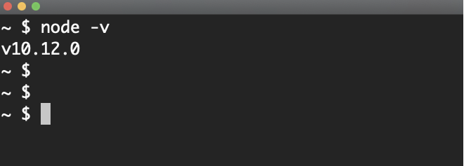

The `-p` option makes it execute a JavaScript line and print out its result, which I found super useful! For example, if I want to see how many CPU cores my machine has, I can use a call to the built-in `os` module, which has a function named `cpus` that returns an array of objects each representing one logical CPU core on the machine. I just need to check the size of that array to count them:

.I should probably upgrade my machine soon
[caption=""]
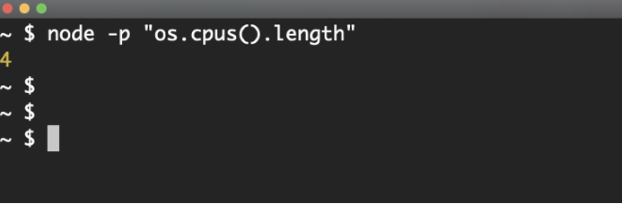

Similarly, here's another one-liner to see the version of the V8 used in the current Node installation:

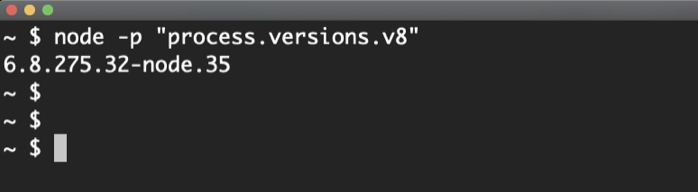

There are many other options for the `node` command; you can see a full list by using the `-h` option. Take a look at these options and familiarize yourself with them. Don't memorize them but just be aware of all the things that you can do with the CLI:

.node -h | less
[caption=""]
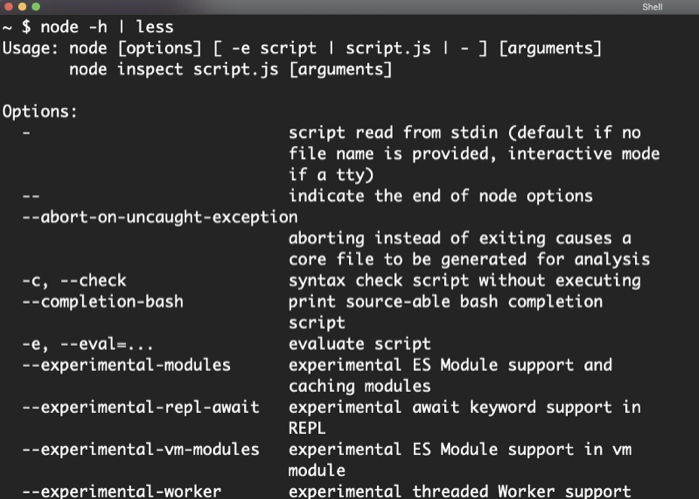

One of the `node` command's options opens the door to the options of V8 itself. Run the `node` command with `--v8-options` and it will report all the V8 options it supports:

.node --v8-options | less
[caption=""]
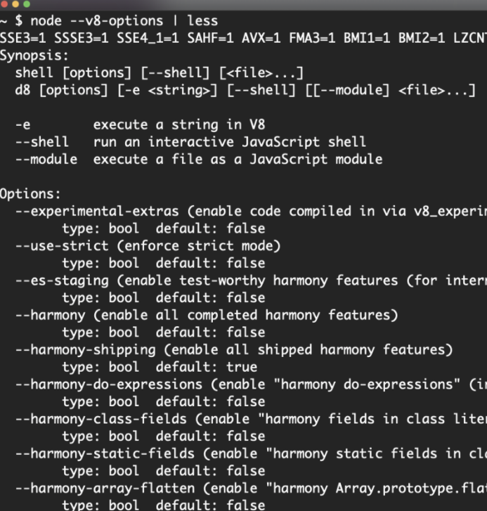

These options get passed to V8 under the hood. For example, to make V8 always execute your JavaScript in *strict mode*, you can pass the `--use-strict` option:

.I wish --use-strict was the default!
[caption=""]
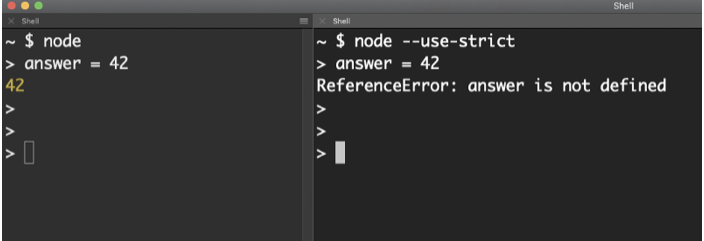

In my current Node installation, I see more than 400 V8 options! These options are mostly for advanced use, but you should know a few things about them:

* Notice the options that begin with the word *harmony*. These flags usually control the experimental features that are still being tested. You can use these experimental features by providing their harmony flag to the node command.

* Notice the options for tracing. If you need V8 to give you more debugging power, you can make it output more information using these options.

* Some options control V8's limits and how it behaves in general. Other options will report information or give you control over what's usually not available without them. For example, notice the following options that will let you control the garbage collection process:

.node --v8-options | grep garbage
[caption=""]
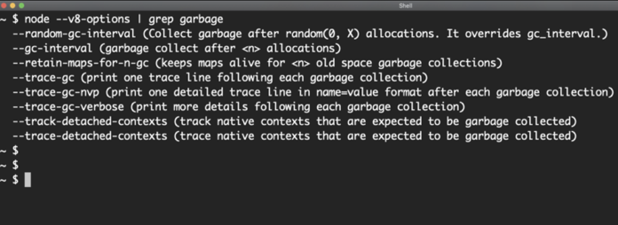

=== Node's Environment Variables

In addition to all the options you can use with the `node` command, it also supports some *environment variables* that you can use to change the behavior of any running Node process.

You can see the full list of the supported environment variables at the end of the `-h` output:

.node -h | tail -25
[caption=""]
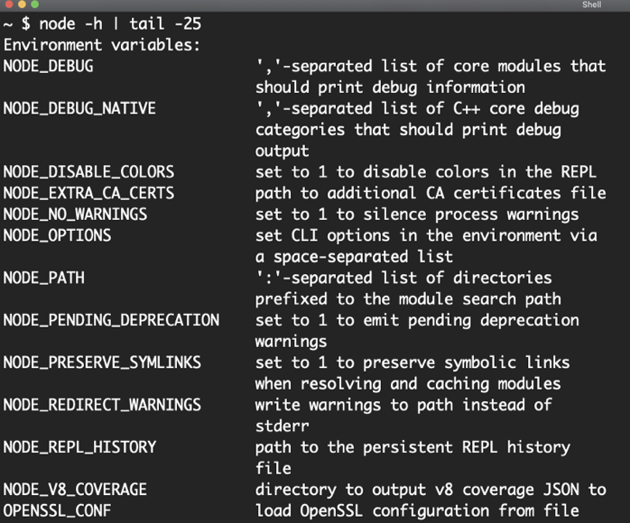

For example, the `NODE_DEBUG` environment variable instructs core modules to print out any debug information they have.

Remember the “Hello World” example from the previous article? If you execute it with `NODE_DEBUG` set to `http` (which is the core module used in that example), the `http` module will print out some debugging messages on each incoming connection:

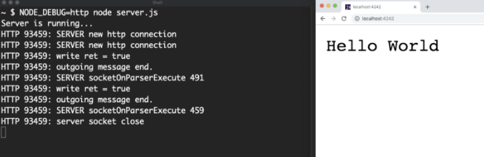

Most Node libraries (both built-in and external) support a `NODE_DEBUG` value. You can give this environment variable a comma-separated list of the modules for which you want to enable debugging.

Another handy environment variable is `NODE_PATH`. By default, node has certain paths it uses to lookup the modules you *require* in your code and you can use this environment variable to override that. I sometimes use this when developing local node packages because I find it a lot simpler than the alternatives.

The built-in environment variables are cool, but did you know that you can have your Node process use your own custom environment variables as well? Let's talk about that next.

== Node's Process Object

Node has a globally available object named `process`. You can use this object without a `require` call and it has handy properties and methods to read information from the running Node process and control its behavior.

One of things that you can read with this object is the environment variables, both the built-in ones and any custom ones you define in the OS environment before running the Node process.

For example, we can do something like:

[source, jsx]
----
**$** VAL1=10 VAL2=20 node script.js
----

Note, there are no commas between the values specified before the node command.

Here's an example script that can read the values of the environment variables we are passing above:

[source, jsx]
[subs="+quotes,+macros"]
----
// script.js
console.log('Current user is'*, process.env.USER);*
console.log('\nScript executed with:');
console.log('VAL1 equal to:'*, process.env.VAL1);*
console.log('VAL2 equal to:'*, process.env.VAL2);*
----

Here is the output of `script.js` as executed with the command line above:

[source]
----
Current user is samer
Script executed with:
VAL1 equal to: 10
VAL2 equal to: 20
----

The `process` object's `env` property is an object that has all the environment properties available through the OS (for example, `process.env.USER` above contained the current OS user). The `env` object also includes the environment variables we customized, like `VAL1` and `VAL2`.

You can also export environment variables prior to executing a script and Node can read those as well. For example, instead of the one liner command above, we can do something like:

[source, jsx]
----
export VAL1=100
export VAL2=200
----

Then, we can execute the same `script.js` above normally:

----
**$** node script.js
----

Node will show the exported `100` and `200` values.

The process object is a handy bridge between the OS and the Node process. You can use it to communicate dynamic configuration values. For example, if you want your web-server script to use port `4242` in development and port `80` in production, you can use `process.env` to make the port value dynamic and control it on different machines.

There is another way to pass information for the execution context of the Node process, which is through the `process.argv` array. This array will have an item for every positional argument you specify when executing the node script in order. For example, if we printed the `process.argv` value using the handy `-p` CLI option like this:

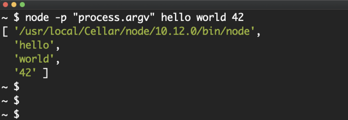

The output we get is an array of all the arguments we pass after the node command,`hello`, `world`, and `4Z`. Note that this array will always contain string values.

The first item in that array is the location of the `node` command. Then, if we were executing a script (instead of using `-p`), the second item in that array will be the script name but in the usage above we're not executing a script so the remaining items in the array were the arguments we passed to the `node` command.

This is a cool feature, but I think I prefer the `process.env` method because I get to name the passed values there. With `argv`, we'd have to do more tricks to accomplish the named-values feature.

Other properties you should be aware of on this special `process` object are the standard input output (*stdio*) objects. There are 3 of them: `process.stdin` (for input), `process.stdout` (for output), and `process.stderr` (for error output).

These objects control the communication channels between the Node process and its OS execution environment. We have been using them under the hood! When you use a `console.log` line, that line writes to the `stdout` object. In fact, you can accomplish the same functionality of `console.log` by using a `process.stdout.write` line:

[source, jsx]
----
process.stdout.write('hello node!\n');
----

The `stdin` object can be used to read information from the OS process. Here's an example on how to do that:

[source, jsx]
[subs="+quotes,+macros"]
----
// echo.js
**process.stdin**.on('readable', () => {
  const chunk = process.stdin.read();
  if (chunk !== null) {
    **process.stdout**.write(chunk);
  }
});
----

All of the `process` stdio objects are *streams*, which is a topic we have yet to explore, but the gist of it is that we can use events and methods to consume these streams. In the script above, we are listening for a `readable` event and using the `read()` method to read a chunk of data. Then, we print out the same *chunk* to `stdout`, making the script effectively an echo utility. It'll echo everything you type to it.

There are multiple ways to consume and benefit from these stdio streams (and streams in general). For example, the same echo example above can be done using the excellent `pipe` function that's available on readable streams:

[source, jsx]
[subs="+quotes,+macros"]
----
// echo2.js
process.stdin.*pipe*(process.stdout);
----

We just *pipe* a readable stream (like `process.stdin`) into a writable one (like `process.stdout`) using the argument for the `pipe` function and this makes the exact same echo utility.

[NOTE]
We'll learn more about streams in upcoming articles but for now just make a mental note that STREAMS ARE AWESOME! and you should utilize them in every possible way.

Node's process object can also be used to terminate the process or do something when the process is terminated unexpectedly. Here is an example of that:

[source, jsx]
[subs="+quotes,+macros"]
----
// process-exit.js
setTimeout(() => process.exit(), 2000);                      // 1

process.on('exit', () => {                                   // 2
  console.log('Process will exit now. See you later!');      // 3
});                                                          // 4

console.log('Hello!');                                       // 5
----

This code will start a *timer* that will fire after 2000 milliseconds and it will call the `exit` function on the `process` object. This will manually terminate the process and make Node exit. As Node is exiting the process, it looks for any listeners registered on the `exit` event. We have done exactly that in the script above, which means right before Node exits it will execute the registered function (lines 2–4) and print out the “_Process will exit now. See you later!_” message.

[source]
----
**$** node process-exit.js

Hello!
----

Then, after 2 seconds:

[source]
----
Process will exit now. See you later!
----

Because of the nature of asynchronous code in Node, the “_Hello!_” line was executed first. Then the timer function was executed and the `exit` listener function was invoked. This simple example demonstrates the power of node asynchronous nature and its event-based methodology. We will learn more about that in upcoming articles.

[IMPORTANT]
--
**This book is part of the jsComplete library which is FREE. We ask you to please donate what you can to https://jscomplete.com/fri[a cause that is fighting racial injustice^]**.

Writing high quality content takes a lot of time. If you found this helpful please consider https://github.com/sponsors/samerbuna[supporting the author^] 🙏.
--
