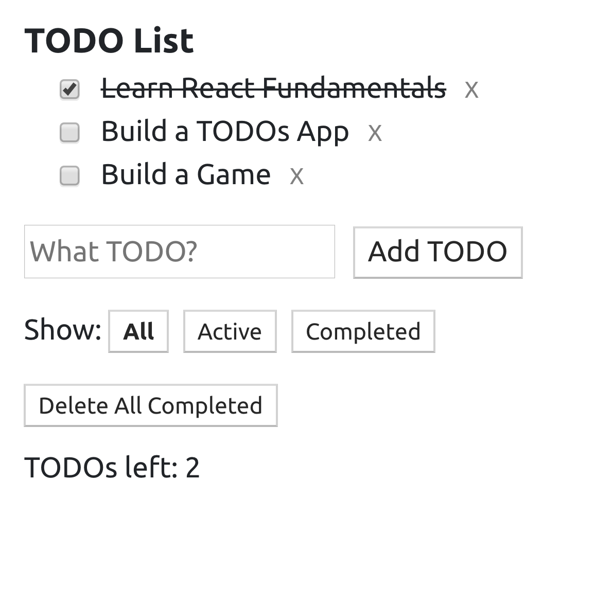
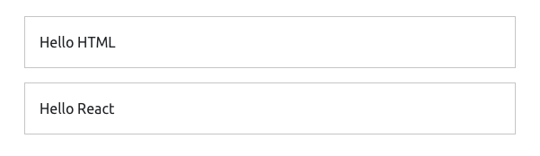
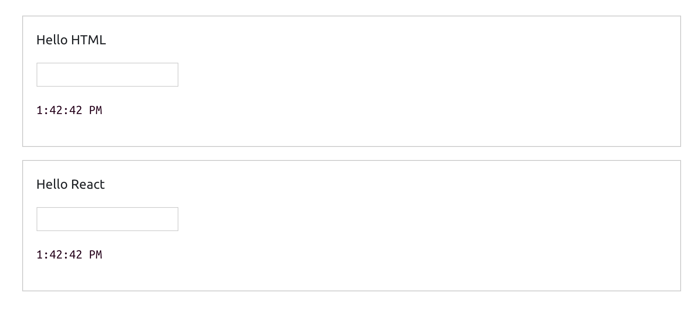
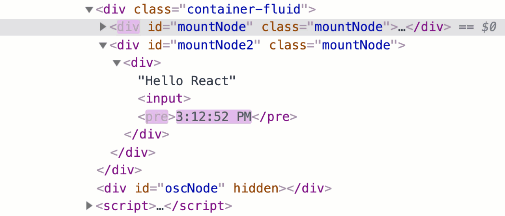
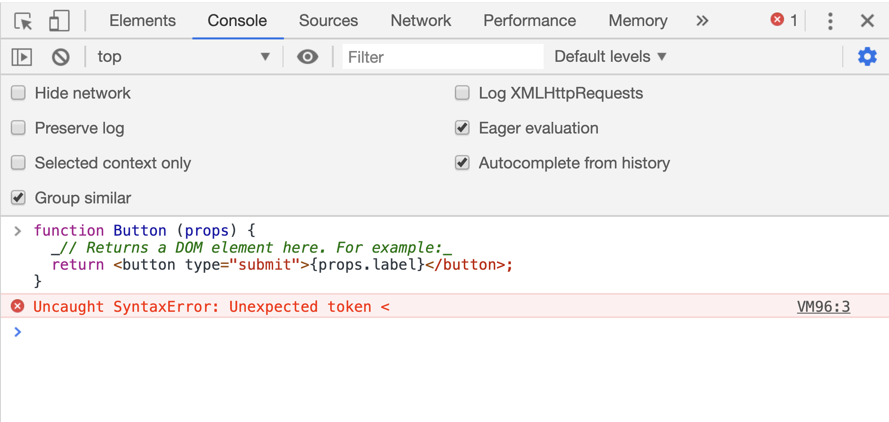
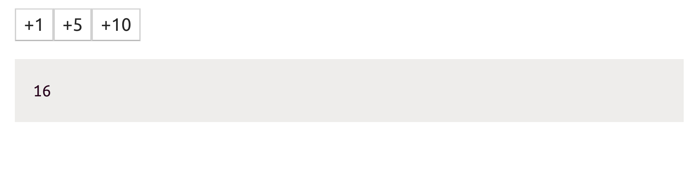

= The React API
ifdef::env-github[]
:tip-caption: :bulb:
:note-caption: :bookmark:
:important-caption: :boom:
:caution-caption: :fire:
:warning-caption: :warning:
endif::[]

Say that we have a list of TODOs like this one:

----
const todos: [
  { body: 'Learn React Fundamentals', done: true },
  { body: 'Build a TODOs App', done: false },
  { body: 'Build a Game', done: false },
];
----

This `todos` array is the starting state of your UI. You'll need to build a UI to display them and manage them. The UI will have a form to add new TODOs, a way for you to mark a TODO as complete, and a way to remove all completed TODOs.

Each of these actions will require the app to do a DOM operation to create, insert, update, or delete DOM nodes. With React, you don't worry about all of these DOM operations. You don't worry about when they need to happen or how to efficiently perform them. You just place the `todos` array in the "state" of your app then use the React language to "command" React to display that state a certain way in the UI:

[source, jsx]
[subs="+quotes,+macros"]
----
<header>TODO List</header>

<ul>
  {todos.map(todo =>
    <li>{todo.body}</li>
  )}
</ul>

// Other form elements...
----

****
Don't worry about the syntax yet but if you're wondering what is going on we simply mapped an array of JavaScript objects into an array of React elements. More on that soon.
****

After that you can focus on just doing data operations on that `todos` array! You add, remove, and update the items of that array and React will reflect the changes you make on this object in the UI rendered in the browser.

This mental model about modeling the UI based on a final state is easier to understand and work with, especially when the views have lots of data transitions. For example, consider the view that tells you how many of your friends are online. That view's "state" will be just one single number of how many friends are currently online. It does not care that a moment ago three friends came online, then one of them disconnected, and then two more joined. It just knows that at this current moment, four friends are online.

== React's tree reconciliation

Before React, when we needed to work with a browser's API, which is known as the DOM API, we avoided traversing the DOM tree as much as possible and there is a reason for that. Any operation on the DOM is done in the same single thread that's responsible for everything else that's happening in the browser, including reactions to user events like typing, scrolling, resizing, etc.

Any expensive operation on the DOM means a slow and janky experience for the user. It is extremely important that your applications do the absolute minimum operations and batch them where possible. React came up with a unique concept to help us do exactly that!

When we tell React to render a tree of elements in the browser, it first generates a virtual representation of that tree and keeps it around in memory for later. Then it'll proceed to perform the DOM operations that will make the tree show up in the browser.

When we tell React to update the tree of elements it previously rendered, it generates a new virtual representation of the updated tree. Now React has 2 versions of the tree in memory!

To render the updated tree in the browser, React does not discard what has already been rendered. Instead, it will compare the 2 virtual versions of the tree that it has in memory, compute the differences between them, figure out what sub-trees in the main tree need to be updated, and only update these sub-trees in the browser.

This process is what's known as the tree reconciliation algorithm and it is what makes React a very efficient way to work with a browser's DOM tree. We'll see an example of it shortly.

Besides the declarative outcomes-based language and the efficient tree reconciliation, here are a few of the other reasons why I think React gained its massive popularity:

- Working with the DOM API is hard. React gives developers the ability to work with a *"virtual" browser* that is friendlier than the real browser. React basically acts like your *agent* who will do the communication with the DOM on your behalf.

- React is often given the "*Just JavaScript*" label. This means it has a very small API to learn and after that your JavaScript skills are what make you a better React developer. This is an advantage over libraries with bigger APIs. Also, the React API is mostly functions (and optionally classes if you need them). When you hear that a UI view is a function of your data, in React that's literally the case.

- Learning React pays off big-time for iOS and Android mobile applications as well. *React Native* allows you to use your React skills to build native mobile applications. You can even share some logic between your web, iOS, and Android applications.

- The React team at Facebook tests all improvements and new features that get introduced to React right there on *facebook.com*, which increases the trust in the library among the community. It's rare to see big and serious bugs in React releases because they only get released after thorough production testing at Facebook. React also powers other heavily used web applications like Netflix, Twitter, Airbnb, and many more.

== Your first React example

To see the practical benefit of the tree reconciliation process and the big difference it makes, let's work through a simple example focused on just that concept. Let's generate and update a tree of HTML elements twice, once using the native Web API and then using the React API (and its reconciliation work). To keep this example simple, I will not use components or JSX (the JavaScript *extension* that's popularly used with React). I will also do the update operation inside a JavaScript *interval* timer. This is not how we write React applications but let's focus on one concept at a time.

Start with this jsComplete playground session: link:https://jsdrops.com/react-dom1[jsdrops.com/react-dom1^].

In this session, a simple HTML element is rendered to the display using 2 methods:

.Method #1: Using the Web DOM API directly
[source, jsx]
----
document.getElementById('mountNode').innerHTML = `
  

    Hello HTML
  

`;
----

.Method #2: Using React's API
[source, jsx]
----
ReactDOM.render(
  React.createElement(
    'div',
    null,
    'Hello React',
  ),
  document.getElementById('mountNode2'),
);
----

The `ReactDOM.render` method and `React.createElement` method are the core API methods in a React application. In fact, a React web application cannot exist without using both of these methods. Let me briefly explain them:

=== ReactDOM.render

This is basically the *entry point* for a React application into the browser's DOM. It has 2 arguments:

1. The first argument is WHAT to render to the browser. This is always a "React element".
2. The second argument is WHERE to render that React element in the browser. This has to be a valid DOM node that exists in the statically rendered HTML. The example above uses a special `mountNode2` element which exists in the playground's display area (the first `mountNode` is used for the native version).

What exactly is a React element? It's a VIRTUAL element describing a DOM element. It's what the `React.createElement` API method returns.

=== React.createElement

Instead of working with strings to represent DOM elements (as in the native DOM example above) in React we represent DOM elements with *objects* using calls to the `React.createElement` method. These objects are known as React elements.

The `React.createElement` function has many arguments:

1. The first argument is the HTML "tag" for the DOM element to represent, which is `div` in this example.

2. The second argument is for any attributes (like `id`, `href`, `title`, etc.) we want the DOM element to have. The simple `div` we're using has no attributes, so we used `null` in there.

3. The third argument is the content of the DOM element. We've put a "Hello React" string in there. The optional third argument and all the optional arguments after it form the *children* list for the rendered element. An element can have 0 or more children.

[NOTE]
`React.createElement` can also be used to create elements from React components.

React elements are created in memory. To actually make a React element show up in the DOM, we use the `ReactDOM.render` method which will do many things to figure out the most optimal way to reflect the state of a React element into the actual DOM tree in the browser.

When you execute the 2 methods in this code session, you'll see a "Hello HTML" box and a "Hello React" box:

=== Nesting React elements

We have two nodes: one being controlled with the DOM API directly and another being controlled with the React API (which in turn uses the DOM API). The only major difference between the ways we are building these two nodes in the browser is that in the HTML version we used a string to represent the DOM tree, while in the React version we used pure JavaScript calls and represented the DOM tree with an object instead of a string.

No matter how complicated the HTML UI is going to get, when using React every HTML element will be represented with a React element.

Let's add more HTML elements to this simple UI. Let's add a text box to read input from the user. For the HTML version, you can just inject the new element's tag directly inside the template:

[source, jsx]
[subs="+quotes,+macros"]
----
document.getElementById('mountNode').innerHTML = `
  

    Hello HTML
    *<input />*
  

`;
----

To do the same with React, you can add more arguments after the third argument for `React.createElement` above. To match what's in the native DOM example so far, we can add a fourth argument that is another `React.createElement` call that renders an `input` element:

[source, jsx]
[subs="+quotes,+macros"]
----
ReactDOM.render(
  React.createElement(
    "div",
    null,
    "Hello React ",
    *React.createElement("input")*
  ),
  document.getElementById('mountNode2'),
);
----

Let's also render the current time in both versions. Let's put it in a `pre` element (just to give it a monospace font in the playground). You can use `new Date().toLocaleTimeString()` to display a simple time string. Here's what you need to do for the native DOM version:

[source, jsx]
[subs="+quotes,+macros"]
----
document.getElementById('mountNode1').innerHTML = `
  

    Hello HTML
    <input />
    *<pre>${new Date().toLocaleTimeString()}
*
  

`;
----

To do the same in React, we add a fifth argument to the top-level `div` element. This new fifth argument is another `React.createElement` call, this time using a `pre` tag with the `new Date().toLocaleTimeString()` string for content:

[source, jsx]
[subs="+quotes,+macros"]
----
ReactDOM.render(
  React.createElement(
    'div',
    null,
    'Hello React ',
    React.createElement('input'),
    *React.createElement(
      'pre',
      null,
      new Date().toLocaleTimeString()
    )*
  ),
  document.getElementById('mountNode2')
);
----

Both versions are still rendering the exact same HTML in the browser.

As you're probably thinking by now, using React is a lot harder than the simple and familiar native way. *What is it that React does so well that is worth giving up the familiar HTML and having to learn a new API to write what can be simply written in HTML?*

The answer is not about rendering the first HTML view. It is about what we need to do to *update* any existing view in the DOM.

=== Updating React elements

Let's do an update operation on the DOM trees that we have so far. Let's simply make the time string *tick* every second.

We can easily repeat a JavaScript function call in a browser using the `setInterval` Web timer API. Let's put all of our DOM manipulations for both versions into a function, name it `render`, and use it in a `setInterval` call to make it repeat every second.

Here is the full code for this example:

[source, jsx]
[subs="+quotes,+macros"]
----
const render = () => {
  document.getElementById('mountNode').innerHTML = `
    

      Hello HTML
      <input />
      <pre>${new Date().toLocaleTimeString()}</pre>
    

  `;

  ReactDOM.render(
    React.createElement(
      'div',
      null,
      'Hello React',
      React.createElement('input', null),
      React.createElement('pre', null, new Date().toLocaleTimeString())
    ),
    document.getElementById('mountNode2')
  );
};

setInterval(render, 1000);
----

Note how the time string is ticking every second in both versions. We are now updating our UI in the DOM.

*This is the moment when React will potentially blow your mind.* If you try to type something in the text box of the native DOM version, you will not be able to. This is very much expected because we are basically throwing away the whole DOM node on every tick and regenerating it. However, if you try to type something in the text box that is rendered with React, you can certainly do so!

Although the whole React rendering code is within the ticking timer, React is changing only the content of the `pre` element and not the whole DOM tree. This is why the text input box was not regenerated and we were able to type in it.

You can see the different ways we are updating the DOM visually if you inspect the two DOM nodes in a Chrome DevTools elements panel. The Chrome DevTools elements panel highlights any DOM elements that get updated. You will see how the native HTML version is regenerating its entire `div#mountNode` container with every tick, while React is smartly only regenerating the `pre` tag in its `div#mountNode2` container.

This is React's smart *diffing* algorithm in action. It only updates in the main DOM tree what actually *needs* to be updated while it keeps everything else the same. This diffing process is possible because of React's virtual DOM representation that it keeps around in memory. No matter how many times the UI views need to be regenerated, React will take to the browser only the needed "partial" updates.

Not only is this method a lot more efficient but it also removes a big layer of complexity in the way we *think* about updating UIs. Having React do all the computations about whether we should or should not update the DOM enables us to focus on thinking about our data (state) and the way to describe a UI for it. We then manage the updates on the data state as needed without worrying about the steps needed to reflect these updates in the actual UI in the browser (because we know React will do exactly that and it will do it in an efficient way!)

== React is all about components

In React, we describe UIs using components that are reusable, composable, and stateful.

We define small components and then put them together to form bigger ones. All components small or big are reusable, even across different projects.

You can think of components as simple functions (in any programming language). We call functions with some input and they give us some output. We can reuse functions as needed and compose bigger functions from smaller ones.

React components are exactly the same; their input is a set of "props" and their output is a description of a UI. We can reuse a single component in multiple UIs and components can contain other components. The basic form of a React component is actually a plain-old JavaScript function.

Some React components are pure but you can also introduce side effects in a component. For example, a component might change the HTML "title" of a web page when it gets mounted in the browser or it might scroll the browser view into a certain position.

Most importantly, a React component can have a private state to hold data that may change over the lifecycle of the component. This private state is an implicit part of the input that drives the component's output and that's actually what gives React its name!

.Why is React named "React" anyway?
****
When the state of a React component (which is part of its input) changes, the UI it represents (its output) changes as well. This change in the description of the UI has to be reflected in the device we are working with. In a browser, we need to update the DOM tree. In a React application we don't do that manually. React will simply *react* to the state changes and automatically (and efficiently) update the DOM when needed.
****

== Creating components using functions

A React component—in its simplest form—is a plain-old JavaScript function:

[source, jsx]
[subs="+quotes,+macros"]
----
// https://jsdrops.com/bx1[jsdrops.com/bx1^]

function Button (props) {
  // Returns a DOM/React element here. For example:
  return <button type="submit">{props.label}</button>;
}

// To render a Button element in the browser
ReactDOM.render(<Button label="Save" />, mountNode);
----

Note how I wrote what looks like HTML in the returned output of the `Button` function above. This is neither HTML nor JavaScript and it is not even React. This is *JSX*. It's an *extension* to JavaScript that allows us to write function calls in an HTML-like syntax.

[TIP]
Go ahead and try to return any other HTML element inside the `Button` function and see how they are all supported (for example, return an `input` element or a `textarea` element).

=== JSX is not HTML

JSX is not understood by browsers. If you try to execute the `Button` function in a regular browser console, it'll complain about the first character in the JSX part:

What browsers understand (given the React library is included) is the `React.createElement` API calls. The same `Button` example can be written without JSX as follows:

[source, jsx]
[subs="+quotes,+macros"]
----
// https://jsdrops.com/bx2[jsdrops.com/bx2^]

function Button (props) {
  return *React.createElement(
    "button",
    { type: "submit" },
    props.label
  );*
}

ReactDOM.render(
  *React.createElement(Button, { label: "Save"})*,
  mountNode
);
----

You can use React like this (without JSX). You can execute the `Button` function in a browser directly (after loading the React library) and things will work just fine. However, we like to see and work with HTML instead of dealing with function calls. When was the last time you built a website with just JavaScript and not used HTML? You can if you want to, but no one does that. That's why JSX exists.

JSX is basically a *compromise*. Instead of writing React components using the `React.createElement` syntax, we use a syntax very similar to HTML and then use a compiler to translate it into `React.createElement` calls.

A compiler that translates one form of syntax into another is known as a "transpiler". To translate JSX we can use transpilers like Babel or TypeScript. For example, the jsComplete playground uses TypeScript to transpile any JSX you put into it. When you use https://github.com/facebook/create-react-app[create-react-app^], the generated app will internally use Babel to transpile your JSX.

[TIP]
You can use https://babeljs.io/repl/[babeljs.io/repl/^] to see what any JSX syntax get converted to for React but JSX can also be used on its own. It is not a React-only thing.

So a React component is a JavaScript function that returns a React element (usually with JSX). When JSX is used, the `<tag></tag` syntax becomes a call to `React.createElement("tag")`. It's absolutely important for you to keep this in mind while building React components. You are not writing HTML. You are using a JavaScript extension to return function calls that create React elements (which are essentially JavaScript objects).

=== The name has to start with a capital letter

Note how I named the component "Button". The first letter being a capital one is actually a requirement since we will be dealing with a mix of HTML elements and React elements. A JSX compiler (like Babel) will consider all names that start with a lowercase letter as names of HTML elements. This is important because HTML elements are passed as strings to `React.createElement` calls while React elements need to be passed as variables:

image::images/name-capital-letter.png[]

Go ahead and try naming the React component "`button`" instead of "`Button`" and see how `ReactDOM` will totally ignore the function and render a regular empty HTML button element.

[source, jsx]
[subs="+quotes,+macros"]
----
// https://jsdrops.com/bx3[jsdrops.com/bx3^]

// Wrong:
function *button* () {
  return 
My Fancy Button
;
};

// The following will render an HTML button
// (and ignore the fancy button function)
ReactDOM.render(*<button />*, mountNode);
----

=== The first argument is an object of "props"

Just like HTML elements can be assigned attributes like `id` or `title`, a React element can also receive a list of attributes when it gets rendered. The `Button` element above (https://jsdrops.com/bx2[jsdrops.com/bx2^]) received a `label` attribute. In React, the list of attributes received by a React element is known as `props`. A React function component receives this list as its first argument. The list is passed as an object with keys representing the attributes names and values representing the values assigned to them.

When using a function component, you don't have to name the object holding the list of attributes as "props" but that is the standard practice. When using class components, which we will do below, the same list of attributes is always presented with a special instance property named `props`.

****
Note that receiving props is optional. Some components will not have any props. However, a component's return value is not optional. A React component cannot return "undefined" (either explicitly or implicitly). It has to return a value. It can return "null" to cause the renderer to ignore its output.
****

I like to use object destructuring whenever I use component props (or state, really). For example, the `Button` component function can be written like this with props destructuring:

.Destructuring a component props
[source, jsx]
[subs="+quotes,+macros"]
----
const Button = (*{ label }*) => (
  <button type="submit">{*label*}</button>
);
----

This approach has many benefits but the most important one is to visually inspect what props are used in a component and make sure a component does not receive any extra props that are not needed.

[NOTE]
Note how I used an *arrow function* instead of a regular one. This is just a style *preference* for me personally. Some people prefer the regular function style and there is nothing wrong with that. I think what's important is to be *consistent* with the style that you pick. I'll use arrow functions here but don't interpret that as a requirement.

=== Expressions in JSX

You can include a JavaScript expression using a pair of curly brackets anywhere within JSX:

[source, jsx]
[subs="+quotes,+macros"]
----
// https://jsdrops.com/bx4[jsdrops.com/bx4^]

const RandomValue = () => (
  

    *{ Math.floor(Math.random() * 100) }*
  

);

ReactDOM.render(<RandomValue />, mountNode);
----

Note that *only expressions* can be included inside these curly brackets. For example, you cannot include a regular if-statement but a ternary expression is okay. Anything that *returns a value* is okay. You can always put any code in a function, make it return something, and call that function within the curly brackets. However, keep the logic you put in these curly brackets to a minimum.

JavaScript variables are also expressions, so when the component receives a list of props you can use these props inside curly brackets. That's how we used `{label}` in the `Button` example.

JavaScript object literals are also expressions. Sometimes we use a JavaScript object inside curly brackets, which makes it look like double curly brackets: `{{a:42}}`. This is not a different syntax; it is just an object literal defined inside the regular JSX curly brackets.

For example, one use case for using an object literal in these curly brackets is to pass a CSS style object to the special `style` attribute in React:

[source, jsx]
[subs="+quotes,+macros"]
----
// https://jsdrops.com/bx5[jsdrops.com/bx5^]

const ErrorDisplay = ({ message }) => (
  

    {message}
  

);

ReactDOM.render(
  <ErrorDisplay
    message="These aren't the droids you're looking for"
  />,
  mountNode
);
----

The `style` attribute above is a special one. We use an object as its value and that object defines the styles as if we are setting them through the JavaScript DOM API (camel-case property names, string values). React translates these style objects into inline CSS style attributes. This is not the best way to style a React component but I find it extremely convenient to use when applying conditional styles to elements. For example, here is a component that will output its text in either green or red randomly about half the time:

[source, jsx]
[subs="+quotes,+macros"]
----
// https://jsdrops.com/bx6[jsdrops.com/bx6^]

class ConditionalStyle extends React.Component {
  render() {
    return (
      

        How do you like this?
      

    );
  }
}

ReactDOM.render(
  <ConditionalStyle />,
  mountNode,
);
----

The logic for this styling is right there in the component. I like that! This is easier to work with than conditionally using a class name and then go track what that class name is doing in the global CSS stylesheet.

=== JSX is not a template language

Some libraries that deal with HTML provide a template language for it. You write your dynamic views with an "enhanced" HTML syntax that has loops and conditionals. These libraries will then use JavaScript to convert the templates into DOM operations. The DOM operations can then be used in the browser to display the DOM tree described by the enhanced HTML.

React eliminated that step. We do not send to the browser a template at all with a React application. We sent it a tree of objects described with the React API. React uses these objects to generate the DOM operations needed to display the desired DOM tree.

[TIP]
When an HTML template is used, the library parses your application as a string. A React application is parsed as a tree of objects.

While JSX might look like a template language, it really isn't. It's just a JavaScript extension that allows us to represent React's tree of objects with a syntax that looks like an HTML template. Browsers don't have to deal with JSX at all and React does not have to deal with it either! Only the compiler does. What we send to the browser is template-free and JSX-free code.

For example, for the `todos` array we've seen above, if we're to display that array in a UI using a template language, we'll need to do something like:

[source]
----
<ul>
  <% FOR each todo in the list of todos %>
    <li><%= todo.body %></li>
  <% END FOR %>
</ul>
----

****
The `<% %>` is one syntax to represent the dynamic enhanced parts. You might also see the `{{ }}` syntax. Some template languages use special attributes for their enhanced logic. Some template languages make use of whitespace indentation (off-side rule).
****

When changes happen to the `todos` array (and we need to update what's rendered in the DOM with a template language) we'll have to either re-render that template or compute where in DOM tree we need to reflect the change in the `todos` array.

In a React application, there is no template language at all. Instead, we use JSX:

[source, jsx]
----
<ul>
  {todos.map(todo =>
    <li>{todo.body}</li>
  )}
</ul>
----

Which, before being used in the browser, gets translated to:

[source, jsx]
----
React.createElement(
  "ul",
  null,
  todos.map(todo =>
    React.createElement("li", null, todo.body)
  ),
);
----

React takes this tree of objects and transforms it into a tree of DOM elements. From our point of view, we're done with this tree. We don't manage any actions on it. We just manage actions in the `todos` array itself.

== Creating components using classes

React supports creating components through the JavaScript class syntax as well. Here is the same Button component example written with the class syntax:

[source, jsx]
[subs="+quotes,+macros"]
----
// https://jsdrops.com/bx7[jsdrops.com/bx7^]

class Button extends React.Component {
  render() {
    return (
      <button>{this.props.label}</button>
    );
  }
}

// Use it (same syntax)
ReactDOM.render(<Button label="Save" />, mountNode);
----

In this syntax, you define a class that extends `React.Component`, which is one of the main classes in the React top-level API. A class-based React component has to at least define an instance method named `render`. This `render` method returns the element that represents the output of an object instantiated from the component. Every time we use the `Button` class-based component  (by rendering a `<Button ... />`), React will *instantiate* an object from this class-based component and use that object's representation to create a DOM element. It'll also associate the DOM-rendered element with the instance it created from the class.

Note how we used `this.props.label` inside the rendered JSX. Every component gets a special instance property named `props` that holds all values passed to that component's element when it was instantiated. Unlike function components, the `render` function in class-based components does not receive any arguments.

== Functions vs classes

Components created with functions used to be limited in React. The only way to make a component "stateful" was to use the class syntax. This has changed with the release of "React Hooks" beginning with React version 16.8, which was released in early 2019. The React hooks release introduced a new API to make a function component stateful (and give it many other features).

With this new API, most of what is usually done with React can be done with functions. The class-based syntax is only needed for advanced and very rare cases.

I believe the new API will slowly replace the old one but that's not the only reason I want to encourage you to use it (exclusively if you can).

I've used both APIs in large applications and I can tell you that the new API is far more superior than the old one for many reasons but here are the ones I personally think are the most important:

- You don't have to work with class "instances" and their implicit state. You work with simple functions that are refreshed on each render. The state is explicitly declared and nothing is hidden. All of this basically means that you'll encounter less surprises in your code.

- You can group related stateful logic and separate it into self-contained composable and sharable units. This makes it easier to break complex components into smaller parts. It also makes testing components easier.

- You can consume any stateful logic in a declarative way and without needing to use any hierarchical "nesting" in components trees.

While class-based components will continue to be part of React for the foreseeable future, as a newcomer to the ecosystem I think it makes sense for you to start purely with just functions (and hooks) and focus on learning the new API (unless you have to work with a codebase that already uses classes).

.Components vs Elements
****
You might find the words "component" and "element" mixed up in the React guides and tutorials out there. I think a React learner needs to understand the important distinctions.

- A React Component is a template. A blueprint. A global definition. This can be either a function or a class (with a render method).

- A React Element is what gets returned from components. It’s an object that virtually describes the DOM nodes that a component represents. With a function component, this element is the object that the function returns and with a class component the element is the object that the component’s render method returns. React elements are not what you see in the browser. They are just objects in memory and you can’t change anything about them.

React internally creates, updates, and destroys objects to figure out the DOM elements tree that needs to be rendered to the browser. When working with class components, it's common to refer to their browser-rendered DOM elements as component instances. You can render many instances of the same component. The instance is the “this” keyword that you use inside class-based components. You would not need to create an instance from a class manually. You just need to remember that it’s there somewhere in React’s memory. For function components, React just uses the invocation of the function to determine what DOM element to render.
****

== Benefits of components

The term "component" is used by many other frameworks and libraries. We can even write web components natively using HTML5 features like custom elements and HTML imports.

Components, whether we are working with them natively or through a library like React, have many advantages.

First, components make your code more *readable* and easier to work with. Consider this UI:

.HTML-Based UI
[source, jsx]
----

----

What does this UI represent? If you speak HTML, you can parse it quickly here and say, “it’s a clickable image.” If we’re to convert this UI into a component, we can just name it `ClickableImage`!

[source, jsx]
----
<ClickableImage />
----

When things get more complex, this parsing of HTML becomes harder so components allow us to quickly understand what a UI represent using the language that we're comfortable with. Here’s a bigger example:

[source, jsx]
----
<TweetBox>
  <TextAreaWithLimit limit="280" />
  <RemainingCharacters />
  <TweetButton />
</TweetBox>
----

Without looking at the actual HTML code, we know exactly what this UI represents. Furthermore, if we need to modify the output of the remaining characters section we know exactly where to go.

React components can also be *reused* in the same application and across multiple applications. For example, here's a possible implementation of the `ClickableImage` component:

.ClickableImage Render Function
[source, jsx]
----
const ClickableImage = ({ href, src }) => {
 return (
   
 );
};
----

Having variables for both the `href` and the `src` props is what makes this component reusable. For example, to use this component we can render it with a set of props:

[source, jsx]
----
<ClickableImage href="http://google.com" src="google.png" />
----

And we can reuse it by using a different set of props:

[source, jsx]
----
<ClickableImage href="http://bing.com" src="bing.png" />
----

[TIP]
--
In functional programming, we have the concept of pure functions. These are basically protected against any outside state; if we give them the same input, we'll always get the same output.

If a React component does not depend on (or modify) anything outside of its definition (for example, if it does not use a global variable) we can label that component pure as well. Pure components have a better chance at being reused without any problems.
--

We create components to represent views. For `ReactDOM`, the React components we define will represent HTML DOM nodes. The `ClickableImage` component above was composed of two nested HTML elements.

We can think of HTML elements as built-in components in the browser. We can also use our own custom components to *compose* bigger ones. For example, let's write a component that displays a list of search engines.

[source, jsx]
----
const SearchEngines = () => {
  return (
    

      <ClickableImage href="http://google.com" src="google.png" />
      <ClickableImage href="http://bing.com" src="bing.png" />
    

  );
};
----

Note how I used the `ClickableImage` component to compose the `SearchEngines` component!

We can also make the `SearchEngines` component reusable as well by extracting its data into a variable and designing it to work with that variable.

For example, we can introduce a data array in a format like:

[source, jsx]
----
const data = [
  { href: "http://google.com", src: "google.png" },
  { href: "http://bing.com", src: "bing.png" },
  { href: "http://yahoo.com", src: "yahoo.png" }
];
----

Then, to make `<SearchEngines data={data} />` work, we just map the `data` array from a list of objects into a list of `ClickableImage` components:

[source, jsx]
----
const SearchEngines = ({ engines }) => {
  return (
    <List>
      {engines.map(engine => <ClickableImage {...engine} />)}
    </List>
  );
};

ReactDOM.render(
 <SearchEngines engines={data} />,
 document.getElementById("mountNode")
);
----

This `SearchEngines` can work with any list of search engines we give to it.

== What exactly are hooks?

A hook in a React component is a call to a special function. All hooks functions begin with the word "use". Some of them can be used to provide a function component with stateful elements (like `useState`), others can be used to managed side effects (like `useEffect`) or to cache/memoize functions and objects (like `useCallback`). Hooks are very powerful and sky is the limit when it comes to things you can do with them.

[TIP]
--
React hook functions can only be used in function components. You can't use them in class components.
--

To see an example of the basic `useState` hook, let's make the `Button` component above respond to a click event. Let's maintain the number of times it gets clicked in a "count" variable and display the value of that variable as the label of the button it renders.

[source, jsx]
[subs="+quotes,+macros"]
----
const Button = () => {
  let count = 0;

  return (
    <button>{*count*}</button>
  );
};

ReactDOM.render(<Button />, mountNode);
----

This `count` variable will be the state element that we need to introduce to the example. It's a piece of data that the UI will depend on (because we're displaying it) and it is a state element because it is going to change over time.

[TIP]
Every time you define a variable in your code you will be introducing a state and every time you change the value of that variable you are mutating that state. Keep that in mind.

Before we can change the value of the `count` state, we need to learn about events.

=== Responding to user events

You can add an event handler with an "onEvent" property (to the `button` element in this case). This could be an `onClick`, `onMouseOver`, `onScroll`, `onSubmit`, etc.

What we need here is an `onClick` event and we just define it as an attribute on the target element. For example, to make the program log a message to the console every time the button is clicked, we can do something like:

.Using onClick in React
[source, jsx]
[subs="+quotes,+macros"]
----
const Button = () => {
  let count = 0;

  return (
    <button *onClick={() => console.log('Button clicked')}*>
      {count}
    </button>
  );
};

ReactDOM.render(<Button />, mountNode);
----

Unlike the DOM version of the `onClick` attribute (which uses a string) the React's `onClick` attribute uses a *function reference*. You specify that inside curly brackets.

[source, jsx]
[subs="+quotes,+macros"]
----
function func() {}

<button onClick={func} />
----

Note how we passed the `func` reference (name) as the `onClick` handler. We did not invoke `func` in there. React will invoke `func` when the button gets clicked.

For the `onClick` event in the `Button` component above, we "inlined" a function definition that when invoked will output a message to the console. Each time we click on the button the `onClick` handler (the inline arrow function) will be invoked and we'll see that message.

[NOTE]
--
Note how the event name is camel-case. All DOM-related attributes (which are handled by React) need to be camel-case (and React will display an error if that's not the case). React also supports using custom HTML attributes and those have to be in all-lowercase format.

Some DOM attributes in React are slightly different from what they do in the regular DOM API. An example of that is the `onChange` event. In a regular browser, it's usually fired when you click outside a form field (or tab out of it). In React, `onChange` fires whenever the value of a form field is changed (on every character added/removed).

Some attributes in React are named differently from their HTML equivalent. An example of that is the `className` attribute in React which is equivalent to using the `class` attribute in HTML. For a complete list of the differences between React attributes and DOM attributes, see link:https://jscomplete.com/react-attributes[jscomplete.com/react-attributes^].
--

=== Reading and updating state

To track state updates and trigger virtual DOM diffing and real DOM reconciliation, React needs to be aware of any changes that happen to any state elements that are used within components. To do this in an efficient way, React requires the use of special getters and setters for each state element you introduce in a component. This is where the `useState` hook comes into play. It defines a state element and give us back a getter and setter for it!

Here's what we need for the count state element we're trying to implement:

[source, jsx]
[subs="+quotes,+macros"]
----
const [count, setCount] = React.useState(0);
----

The `useState` function returns an array with exactly 2 items. The first item is a value (getter) and the second item is a function (setter). I used array destructuring to give these items names. You can give them any names you want but `[name, setName]` is the convention.

The first item "value" can be a string, number, array, or other types. In this case, we needed a number and we needed to initialize that number with `0`. The argument to `React.useState` is used as the initial value of the state element.

The second item "function" will change the value of the state element when invoked (and it will trigger DOM processing if needed). Each time the `setCount` function is invoked, React will re-render the `Button` component which will refresh all variables defined in the component (including the `count` value). The argument we pass to `setCount` becomes the new value for `count`.

What we need to do to make the button increment its label is to invoke the `setCount` function within the `onClick` event and pass the current `count` value incremented by 1 to it. Here's the full code of the label-incrementing button example:

[source, jsx]
[subs="+quotes,+macros"]
----
const Button = () => {
  const [count, setCount] = useState(0);

  return (
    <button *onClick={() => setCount(count + 1)}*>
      {count}
    </button>
  );
};

ReactDOM.render(<Button />, mountNode);
----

Go ahead and test that. The button will now increment its label on each click.

Note how we did not implement any actions to change the UI itself. Instead, we implemented an action to change a JavaScript object (in memory)! Our UI implementation was basically telling React that we want the label of the button to always reflect the value of the `count` object. Our code didn't do any DOM updates. React did.

Note also how I used the `const` keyword to define `count` although it's a value that gets changed! Our code will not change that value. React will when it uses a fresh call of the `Button` function to render the UI of its new state. In that fresh call, the `useState` function call will give us a new fresh `count` value.

[NOTE]
****
The `useState` function is available globally in the jsComplete playground. This is just an alias to `React.useState`. In your code, you can use named imports to have `useState` available directly in the scope of a module:

[source, jsx]
----
import React, { useState } from 'react';
----
****

You'll need a few more examples to appreciate this power. Let's add some more features to this basic example. Let's have many buttons and make all of them increment a single shared count value.

== Working with multiple components

Let's split the `Button` component that we have so far into two components:

- Keep a `Button` component to represent a button element, but with a static label.
- Add a new `Display` component to display the count's value.

The new `Display` component will be a purely presentational one with no state or interactions of its own. That's normal. Not every React component has to have stateful hooks or be interactive.

[source, jsx]
[subs="+quotes,+macros"]
----
const Display = (props) => (
  <pre>COUNT VALUE HERE...</pre>
);
----

The responsibility of the `Display` component is to simply display a value that it will receive as a prop. For example, the fact that a `pre` element was used to host the value is part of that responsibility. Other components in this application have no say about that!

=== Rendering sibling components

We now have two elements to render: `Button` and `Display`. We can't render them directly next to each other like this:

[source, jsx]
[subs="+quotes,+macros"]
----
// This will not work

ReactDOM.render(*<Button /><Display />*, mountNode);
----

Adjacent elements can't be rendered like this in React because each of them gets translated into a function call when JSX gets converted. You have a few options to deal with this issue.

First, you can pass an array of elements to `ReactDOM.render` and insert into that array as many React elements as you wish.

.Option #1
[source, jsx]
[subs="+quotes,+macros"]
----
ReactDOM.render(*[<Button />, <Display />]*, mountNode);
----

This is usually a good solution when all the elements you're rendering are coming from a dynamic source. However, it's not ideal for the case we're doing here.

Another option is to make the sibling React elements the children of another React element. For example, we can just enclose them in a `div` element.

.Option #2
[source, jsx]
[subs="+quotes,+macros"]
----
ReactDOM.render(
  **

    <Button />
    <Display />
  
**,
  mountNode
);
----

The React API supports this nesting. In fact, React has a special object if you need to enclose multiple adjacent elements like this without introducing a new DOM parent node. You can use `React.Fragment`:

.Option #3
[source, jsx]
[subs="+quotes,+macros"]
----
ReactDOM.render(
  **<React.Fragment>
    <Button />
    <Display />
  </React.Fragment>**,
  mountNode
);
----

This case is so common in React that the JSX extension has a shortcut for it. Instead of typing `React.Fragment`, you can just use an empty tag `<></>`.

.Option #3+
[source, jsx]
[subs="+quotes,+macros"]
----
ReactDOM.render(
  **<>
    <Button />
    <Display />
  </>**,
  mountNode
);
----

The empty tag will get transpiled into the `React.Fragment` syntax. I'll use this syntax to continue with the example.

However, you should always try to make the first argument to `ReactDOM.render` a single component call instead of the nested tree that we just did. This is essentially a code quality preference. It forces you into thinking about your components hierarchy, names, and relations. Let's do that next.

=== The top-level component

Let's introduce a top-level component to host both the `Button` and `Display` components. The question now is: what should we name this new parent component?

****
Believe it or not, naming your components and their state/props elements is a very hard task that will affect the way these components work and perform. The right names will force you into the right design decisions. Take some time and think about every new name you introduce to your React apps.
****

Since this new parent component will host a `Display` with a `Button` that increments the displayed count, we can think of it as the count value *manager*. Let's name it `CountManager`.

[source, jsx]
[subs="+quotes,+macros"]
----
const CountManager = () => {
  return (
    <>
      <Button />
      <Display />
    </>
  );
};

ReactDOM.render(<CountManager />, mountNode);
----

Since we're going to display the count's value in the new `Display` component, we no longer need to show the count's value as the label of the button. Instead, we can change the label to something like "+1".

[source, jsx]
[subs="+quotes,+macros"]
----
const Button = () => {
  return (
    <button onClick={() => console.log('TODO: Increment counter')}>
      **+1**
    </button>
  );
};
----

Note that I've also removed the state element from the `Button` component because we can't have it there anymore. With the new requirement, both the `Button` and `Display` components need access to the `count` state element. The `Display` component will display it and the `Button` component will update it. When a component needs to access a state element that's owned by its sibling component, one solution is to "lift" that state element one level up and define it inside their parent component. For this case the parent is the `CountManager` component that we just introduced.

By moving the state to `CountManager`, we can now "flow" data from parent to child using component props. That's what we should do to display the count value in the `Display` component:

[source, jsx]
[subs="+quotes,+macros"]
----
const Display = (**{ content }**) => (
  <pre>**{content}**</pre>
);

const CountManager = () => {
  *const [count, setCount] = useState(0);*

  return (
    <>
      <Button />
      <Display **content={count}** />
    </>
  );
};

ReactDOM.render(<CountManager />, mountNode);
----

Note how in `CountManager` I used the exact same `useState` line that was in the `Button` component. We are lifting the same state element. Also note how when I flowed the `count` value down to the `Display` component via a prop, I used a different name for it (`content`). That's normal. You don't have to use the exact same name. In fact, in some cases, introducing new generic names are better for children component because they make them more reusable. The `Display` component could be reused to display other numeric values besides `count`.

Parent components can also flow down behavior to their children, which is what we need to do next.

Since the `count` state element is now in the `CountManager` component, we need a function on that level to handle updating it. Let's name this function `incrementCounter`. The logic for this function is actually the same logic we had before in the `handleClick` function in the `Button` component. The new `incrementCounter` function is going to update the `CountManager` component `count` state to increment the value using the previous value:

[source, jsx]
[subs="+quotes,+macros"]
----
const CountManager = () => {
  // ...

  **const incrementCounter = () => {
    setCount(count + 1);
  }**

  // ...
};
----

The `onClick` handler in the `Button` component now has to change. We want it to execute the `incrementCounter` function that's in the `CountManager` component but a component can only access its own functions. So, to make the `Button` component able to invoke the `incrementCounter` function in the `CountManager` component we can pass a reference to `incrementCounter` to the `Button` component as a prop. Yes, props can hold functions as well, not just data. Functions are just objects in JavaScript and just like objects you can pass them around.

We can name this new prop anything. I'll name it `clickAction` and pass it a value of `incrementCounter`, which is the reference to the function we defined in the `CountManager` component. We can use this new passed-down behavior directly as the `onClick` handler value. It will be a prop for the `Button` component:

[source, jsx]
[subs="+quotes,+macros"]
----
const Button = ({ *clickAction* }) => {
  return (
    <button **onClick={clickAction}**>
      +1
    </button>
  );
};

// ...

const CountManager = () => {
  // ...

  return (
    

      <Button **clickAction={incrementCounter}** />
      <Display content={count} />
    

  );
};
----

Something very powerful is happening here. This `clickAction` property allowed the `Button` component to invoke the `CountManager` component's `incrementCounter` function. It's like when we click that button, the `Button` component reaches out to the `CountManager` component and says, "_Hey Parent, go ahead and invoke that increment counter behavior now"._

In reality, the `CountManager` component is the one in control here and the `Button` component is just following generic rules. If you analyze the code as it is now, you'll realize how the `Button` component has no clue about what happens when it gets clicked. It just follows the rules defined by the parent and invokes a generic `clickAction`. The parent controls what goes into that generic behavior. This follows the concept of responsibility isolation. Each component here has certain responsibilities and they get to focus on that.

Look at the `Display` component for another example. From its point of view, the count value is not a state.  It is just a prop that the `CountManager` component is passing to it. The `Display` component will always display that prop. This is also a separation of responsibilities.

As the designer of these components, you get to choose their level of responsibilities. For example, we could have made the responsibility of displaying the count value part of the `CountManager` component itself and not use a new `Display` component for that.

The `CountManager` component has the responsibility of managing the count state. That's an important design decision that we made and it's one you're going to have to make a lot in a React application. Where to define the state?

The practice I follow is to define a state element in a shared parent node that's as close as possible to the all the children who need to access that state element. For a small application like this one, that usually means the top-level component itself. In bigger applications, a sub-tree might manage its own state "branch" rather than relying on global state elements that are defined on the top-level root component.

[TIP]
The top-level component is popularly used to manage shared application state and actions because it's parent to all other components. Be careful about this design because updating a state element on the top-level component means that the whole tree of components will be re-rendered (in memory).

Here's the full code for this example so far:

[source, jsx]
[subs="+quotes,+macros"]
----
// https://jsdrops.com/bx8[jsdrops.com/bx8^]

const Button = ({ clickAction }) => {
  return (
    <button onClick={clickAction}>
      +1
    </button>
  );
};

const Display = ({ content }) => (
  <pre>{content}</pre>
);

const CountManager = () => {
  const [count, setCount] = useState(0);

  const incrementCounter = () => {
    setCount(count + 1);
  };

  return (
    

      <Button clickAction={incrementCounter} />
      <Display content={count} />
    

  );
};
----

== Making components reusable

Components are all about reusability. Let's make the `Button` component reusable by changing it so that it can increment the global count with any value, not just `1`.

Let's start by adding more `Button` elements in the `CountManager` component so that we can test this new feature:

[source, jsx]
[subs="+quotes,+macros"]
----
const CountManager = () => {
  // ..

  return (
    <>
      *<Button clickAction={incrementCounter} />* _{pass:[/* +1 */]}_
      *<Button clickAction={incrementCounter} />* _{pass:[/* +5 */]}_
      *<Button clickAction={incrementCounter} />* _{pass:[/* +10 */]}_
      <Display count={count} />
    </>
  );
};
----

All `Button` elements rendered above will currently have a `+1` label and they will increment the count with 1. We want to make them display a different label that is specific to each button and make them perform a different action based on a value that is specific to each of them. Remember that you can pass any value to a React element as a prop.

Here's the UI I have in mind after clicking each button once:

.The `count` started with 0. We added 1, then 5, and then 10 to get to 16

[TIP]
Before we go through this exercise, take some time and think about it and try to implement it yourself. It is mostly straightforward. Hint: you'll need to introduce 1 new prop for `Button`. Give it a shot. Come back when you are ready to compare your solution with mine.

=== Adding new props

The first thing we need to do is make the `+1` label in the `Button` component a customizable one.

To make something customizable in a React component we introduce a new prop (which the parent component can control) and make the component use its value. For our example, we can make the Button component receive the amount to increment (`1`, `5`, `10`) as a new prop. I'll name it `clickValue`. We can change the render method in `CountManager` to pass the values we want to test with to this new prop.

[source, jsx]
[subs="+quotes,+macros"]
----
return (
  <>
    <Button clickAction={incrementCounter} *clickValue={1}* />
    <Button clickAction={incrementCounter} *clickValue={5}* />
    <Button clickAction={incrementCounter} *clickValue={10}* />
    <Display content={count} />
  </>
);
----

Note a couple of things about this code so far:

- I did not name the new property with anything related to `count`. The `Button` component does not need to be aware of the meaning of its click event. It just needs to pass this `clickValue` along when its click event is triggered. For example, naming this new property `countValue` would not be the best choice because now, in the `Button` component, we read the code to understand that a `Button` element is related to a count. This makes the `Button` component less reusable. For example, if I want to use the same `Button` component to append a letter to a string, its code would be confusing.

- I used curly brackets to pass the values of the new `clickValue` property `(clickValue={5})`. I did not use strings there `(clickValue="5")`. Since I have a mathematical operation to do with these values (every time a `Button` is clicked), I need these values to be numbers. If I pass them as strings, I would have to do some string-to-number conversion when the add operation is to be executed.

[TIP]
--
Passing a number as a string is a common mistake in React. See https://jscomplete.com/learn/react-beyond-basics/react-cfp[this article^] for more React-related common mistakes.
--

=== Customizing behaviors

The other thing we need to make generic in the `CountManager` component is the `incrementCounter` action function. It cannot have a hardcoded `count + 1` operation as it does now. Similar to what we did for the `Button` component, to make a function generic we make it receive an argument and use that argument's value. For example:

[source, jsx]
[subs="+quotes,+macros"]
----
incrementCounter = (**incrementValue**) => {
  setCount(count + **incrementValue**);
};
----

Now all we need to do is make the `Button` component use its `clickValue` prop as its label and make it invoke its `onClick` action with its `clickValue` as an argument.

[source, jsx]
[subs="+quotes,+macros"]
----
const Button = ({ clickValue, clickAction }) => {
  return (
    <button onClick={**() => clickAction(clickValue)**}>
      **+{clickValue}**
    </button>
  );
};
----

Note how I had to wrap the `clickAction` prop with an inline arrow function in order to bind it to the Button's `clickValue`. The JavaScript closure for this new arrow function will take care of that.

The three buttons should now increment with their three different click values:

[source, jsx]
[subs="+quotes,+macros"]
----
// https://jsdrops.com/bx9[jsdrops.com/bx9^]

const Button = ({ clickValue, clickAction }) => {
  return (
    <button onClick={() => clickAction(clickValue)}>
      +{clickValue}
    </button>
  );
};

const Display = ({ content }) => (
  <pre>{content}</pre>
);

const CountManager = () => {
  const [count, setCount] = useState(0);

  const incrementCounter = (increment) =>
    setCount(count + increment);

  return (
    

      <Button clickAction={incrementCounter} clickValue={1} />
      <Button clickAction={incrementCounter} clickValue={5} />
      <Button clickAction={incrementCounter} clickValue={10} />
      <Display content={count} />
    

  );
}

ReactDOM.render(<CountManager />, mountNode);
----

== Accepting input from the user

Imagine we need to count the characters a user type in a text area, just like Twitter's tweet form. With each character the user types we need to update the UI with the new count of characters.

Here's a component that displays a `textarea` input element with a placeholder div for the character count:

[source, jsx]
[subs="+quotes,+macros"]
----
// https://jsdrops.com/bx10[jsdrops.com/bx10^]

const CharacterCounter = () => {
  return (
    

      <textarea cols={80} rows={10} />
      
Count: X

    

  );
};

ReactDOM.render(<CharacterCounter />, mountNode);
----

To update the count as the user types in the `textarea`, we need to customize the event that fires when the user types. This event in React is implemented as `onChange`. We'll also need to use a state element for the count of characters and fire its updater function within the `onChange` event.

In the new `onChange` event handler that we need to come up with, we'll need access to the text that was typed in the `textarea` element. We need to read it somehow because React by default is not aware of it. As the user types, the rendered UI changes through the browser's own state management. We did not instruct React to change the UI based on the value of the `textarea` element.

We can read the value using two main methods. First, we can read it by using the DOM API itself directly. We'll need to "select" the element with a DOM selection API and once we do that we can read its value using an `element.value` call. To select the element we can simply give it an ID and using the `document.getElementById` DOM API to select it.

Because React renders the `textarea` element we can actually do the element selection through React itself. React has a special "ref" attribute that we can assign to each DOM element and later use it to access it.

We can also access the element through the `onChange` event's target object directly. Each event exposes its target and in the case of an `onChange` event on a `textarea` the target is the `textarea` element.

That means all we need to do is:

[source, jsx]
[subs="+quotes,+macros"]
----
// https://jsdrops.com/bx11[jsdrops.com/bx11^]

const CharacterCounter = () => {
  const [count, setCount] = useState(0);

  const handleChange = (event) => {
    const element = event.target;
    setCount(element.value.length);
  };

  return (
    

      <textarea cols={80} rows={10} onChange={handleChange} />
      
Count: {count}

    

  );
};

ReactDOM.render(<CharacterCounter />, mountNode);
----

This is the simplest solution and it actually works fine. The not-ideal thing about this solution is that we're mixing concerns. The `handleChange` event has the side effect of calling the `setCount` function and computing the length of the text. This is really not the concern of an event handler.

The reason we needed to mix these concerns is that React is not aware of what is being typed. It's a DOM change, not a React change.

We can make it into a React change by overriding the value of `textarea` and updating it through React as a state change. In the `onChange` handler, instead of counting the characters we just set the value of what has been typed on the state of the component. Then the concern of what to do with that value becomes part of the React UI render logic. Here's a version of the solution that uses this strategy:

[source, jsx]
[subs="+quotes,+macros"]
----
// https://jsdrops.com/bx12[jsdrops.com/bx12^]

const CharacterCounter = () => {
  const [inputValue, setInputValue] = useState('');

  const handleChange = (event) => {
    const element = event.target;
    setInputValue(element.value);
  };

  return (
    

      <textarea cols={80} rows={10} value={inputValue} onChange={handleChange} />
      
Count: {inputValue.length}

    

  );
};

ReactDOM.render(<CharacterCounter />, mountNode);
----

Although this is a bit more code it has clear separation of concerns. React is now aware of the input element state. It controls it. This pattern is known as the controlled component pattern in React.

This version is also easier to extend. If we're to compute the number of words as the user types, this becomes another UI computed value. No need to add anything else on the state.

== Managing side effects

Rendering a React component in the browser for the first time is referred to as "mounting" and removing it from the browser is referred to as "unmounting".

Mounting, updating, and unmounting components might need to have a "side effect". For example, a React TODOs app might need to display the number of active TODO items in the title of the browser page. This is not something you can do directly with the React API. You need to use the DOM API for it. Similarly, when rendering an input form you might want to auto-focus a text box. That too has to be done with the DOM API.

Side effects usually need to happen either before or after React's render task. This is why React provides "lifecycle methods" in class components to let you perform custom operations before or after the render method. You can do things after a component is first mounted inside a `componentDidMount` class method, you can do things after a components gets an update inside a `componentDidUpdate` class method, and you can do things right before a component is removed from the browser inside a `componentWillUnmount` class method.

For function components, side effects are managed using the `React.useEffect` hook function, which takes 2 arguments: a callback function and an array of dependencies.

[source, jsx]
[subs="+quotes,+macros"]
----
useEffect(() => {
  // Do something after each rende
  // but only if dep1 or dep2 changed_
}, [dep1, dep2]);
----

The first time React renders a component that has a `useEffect` call it'll invoke its callback function. After each new render of that component, if the values of the dependencies are different from what they used to be in the previous render, React will invoke the callback function again.

[TIP]
When a function component is updated or unmounted, React can invoke a side effect "cleanup" function. That cleanup function can be returned from the `useEffect` callback function.

Side effects methods are also very handy for analyzing what is going on in the application and for further optimizing the performance of React updates.

[IMPORTANT]
--
**This book is part of the jsComplete library which is FREE. We ask you to please donate what you can to https://jscomplete.com/fri[a cause that is fighting racial injustice^]**.

Writing high quality content takes a lot of time. If you found this helpful please consider https://github.com/sponsors/samerbuna[supporting the author^] 🙏.
--
